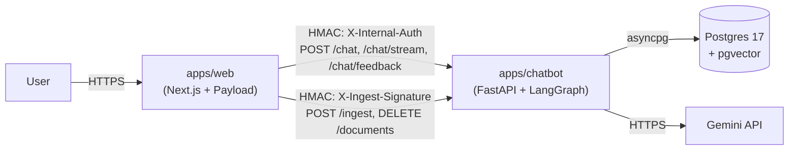
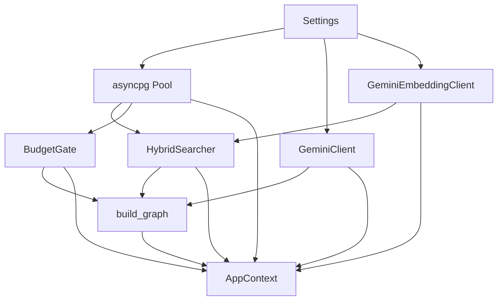

# Architecture Overview

## What this service is

`apps/chatbot` is an internal-only RAG service that powers the AI assistant on
habib36.dev. It is never exposed to the public internet: all user traffic
terminates at `apps/web` (Next.js + Payload CMS), and `apps/web` proxies chat
and ingest requests over the Docker internal network using HMAC-signed headers.
The service is purpose-built for one job — answering questions about Habibur
Rahman from a grounded, retrieved knowledge base — and deliberately excludes
generic multi-tenant RAG concerns.

---

## System context

The diagram below shows every trust boundary and transport in the system.

`apps/web` is the sole entry point for public users. It handles CSRF, IP-level
rate limiting (Upstash), and optional response caching before forwarding to the
chatbot. The chatbot never sees raw browser traffic, which keeps the Python
attack surface small and lets Node own the public-facing security primitives.

---

## Package map

| Package | One-line purpose | Entry point |
|---|---|---|
| `chatbot/agent/` | LangGraph graph builder and all node implementations | `chatbot/agent/graph.py:76` (`build_graph`) |
| `chatbot/api/` | FastAPI router, DI providers, request/response schemas, SSE helpers | `chatbot/api/routes.py:44` (`router`) |
| `chatbot/llm/` | Gemini client protocols and concrete implementations, per-day budget gate | `chatbot/llm/base.py` (protocols); impl in `chatbot/llm/gemini.py` |
| `chatbot/retrieval/` | Text chunker, Gemini embedding client, hybrid pgvector+BM25 searcher | `chatbot/retrieval/pgvector.py` (`HybridSearcher`) |
| `chatbot/ingest/` | Chunk → embed → upsert pipeline; idempotent per document | `chatbot/ingest/service.py` |
| `chatbot/db/` | asyncpg pool factory and per-table repositories | `chatbot/db/pool.py`, `chatbot/db/chunks_repo.py`, `chatbot/db/chat_log_repo.py`, `chatbot/db/budget_repo.py` |
| `chatbot/security/` | HMAC verification, PII redaction, heuristic prompt-injection detection | `chatbot/security/hmac.py`, `chatbot/security/pii.py`, `chatbot/security/prompt_injection.py` |
| `chatbot/observability/` | structlog JSON logging, Prometheus metrics, OpenTelemetry tracing | `chatbot/observability/logger.py`, `chatbot/observability/metrics.py`, `chatbot/observability/tracing.py` |

---

## Lifespan & dependency injection

The application is constructed by `create_app(context=None)` in
`chatbot/main.py:42`. The `context` parameter is the DI seam: in production it
is `None`, so the lifespan function at `chatbot/main.py:52` builds every
singleton from scratch and attaches it to `app.state.context`. In tests, a
pre-built `AppContext` populated with fakes is passed directly, so the test
suite never touches Gemini or Postgres.

This pattern means every singleton — the asyncpg pool, both Gemini clients, the
hybrid searcher, the budget gate, and the compiled graph — is created **once per
process** during startup. Request handlers retrieve them by calling
`get_context(request)` in `chatbot/api/deps.py:29`, which reads
`request.app.state.context`. There is no per-request construction cost and no
risk of leaking connections.

The dependency chain during a real lifespan boot is:

`Settings` (pydantic-settings, `chatbot/config.py:10`) is the single source of
truth for every tunable: pool sizes, model names, HMAC secrets, retrieval
parameters, budget caps. Everything downstream receives only the values it
needs; nothing reaches back to `Settings` after startup.

The `AppContext` dataclass at `chatbot/api/deps.py:16` carries:

- `pool` — the asyncpg connection pool (closed in the finally block at
  `chatbot/main.py:96`).
- `llm` / `embedder` — Gemini clients; typed as protocols (`LLMClient`,
  `EmbeddingClient`) so tests can substitute fakes.
- `searcher` — the `HybridSearcher` that owns retrieval.
- `budget` — the `BudgetGate` that enforces the daily token cap.
- `chat_log_repo` — inserts PII-scrubbed log rows after every chat turn.
- `graph` — the compiled LangGraph graph returned by `build_graph`.
- `pro_model` / `flash_model` / `per_request_token_cap` — config values passed
  through to route handlers that need them.

---

## Architectural decisions

### 1. LangGraph over a hand-rolled state machine

**Decision.** The multi-step RAG pipeline is expressed as a LangGraph
`StateGraph` rather than as a sequence of `await` calls in a single function.

**Why.** The pipeline has conditional branching (intent routing, retrieval
retry, groundedness retry) and the branch structure was going to grow. LangGraph
makes edges and routing functions explicit and named, which makes the flow easy
to read and extend without hunting through nested `if` blocks. The compiled
graph also gives `astream_events` for free, which powers the SSE endpoint
without extra work (see `chatbot/api/routes.py:139`).

**Tradeoff.** LangGraph is an additional dependency with its own version
lifecycle and a compile step (`g.compile()` at `chatbot/agent/graph.py:156`).

---

### 2. pgvector over a dedicated vector DB

**Decision.** Vector storage and retrieval use pgvector inside the same Postgres
instance that Payload CMS already uses, rather than Pinecone, Qdrant, or
Weaviate.

**Why.** The knowledge base is small (a personal portfolio), so dedicated vector
DB throughput is not needed. Keeping everything in one Postgres instance removes
a second stateful service to run, back up, and keep in sync. The `chatbot`
schema is isolated from Payload's `public` schema by a dedicated
`chatbot_app` role.

**Tradeoff.** pgvector's ANN index (HNSW) has lower recall than
purpose-built vector DBs at large scale, and Postgres cannot shard vectors
horizontally.

---

### 3. HMAC over JWT for internal calls

**Decision.** `apps/web` authenticates to the chatbot using HMAC-SHA256
signatures in `X-Internal-Auth` and `X-Ingest-Signature` headers rather than
JWTs (see `chatbot/security/hmac.py:1`).

**Why.** JWTs require a key-distribution infrastructure and expiry management.
For a fixed two-service internal call, a pre-shared HMAC secret is simpler and
harder to misconfigure. The signature covers the timestamp, path, and body hash
(`chatbot/security/hmac.py:18-20`), so it also provides replay protection via the
`replay_window_seconds` setting.

**Tradeoff.** Rotating secrets requires a coordinated deploy of both services;
there is no key-distribution protocol.

---

### 4. Gemini Flash for cheap nodes, Pro for generation only

**Decision.** Six nodes use `gemini-2.5-flash` (`classify_intent`,
`rewrite_query`, `grade_chunks`, `check_groundedness`, `output_guard`,
`smalltalk_reply`). Only `generate_answer` uses `gemini-2.5-pro` (see
`chatbot/agent/graph.py:91-107`).

**Why.** Flash is roughly 10× cheaper than Pro per token and has lower latency.
The classification, rewriting, grading, groundedness-check, output-guard, and
smalltalk nodes need fast, cheap inference. The answer node needs the higher
quality of Pro because the answer is what the user actually reads.

**Tradeoff.** Flash occasionally produces less precise grades or groundedness
labels, which may trigger unnecessary retries and inflate cost on the tail.

---

### 5. Lifespan-built singletons over per-request init

**Decision.** Clients, the database pool, and the compiled graph are created
once during FastAPI lifespan (`chatbot/main.py:59-96`) and stored on
`app.state`.

**Why.** asyncpg pool creation involves TCP handshakes and Postgres auth; Gemini
client construction involves SDK setup. Paying those costs on every request
would add 50–200 ms of overhead and risk exhausting connections under load.
Lifespan construction also makes the failure mode clear: if Postgres is
unavailable at startup, the service refuses to start.

**Tradeoff.** The process must be restarted to pick up a new API key or
changed pool size.

---

### 6. In-process budget gate over an external rate limiter

**Decision.** Token spend is tracked in a `chatbot.usage_budget` Postgres table
and enforced by `BudgetGate` (`chatbot/llm/budget.py:17`) inside the same
process, rather than delegating to Redis or Upstash.

**Why.** The chatbot is a single-process service. An in-process gate backed by
Postgres avoids a network hop to a separate rate-limit store and keeps the
dependency count low. The design spec explicitly excluded Redis.

**Tradeoff.** Horizontal scaling (multiple chatbot replicas) would cause
budget under-counting because each replica reads its own Postgres row
without coordination. The current deployment is single-replica.

---

### 7. SSE over WebSocket for streaming

**Decision.** Token streaming uses Server-Sent Events (`chatbot/api/routes.py:127`)
rather than a WebSocket connection.

**Why.** The chatbot interaction is unidirectional during generation: the client
sends one request and the server streams tokens back. SSE is half-duplex by
design, works through standard HTTP/1.1, and is trivial to proxy from Next.js.
WebSockets would require a dedicated upgrade handler and persistent connection
management on both sides for no added value.

**Tradeoff.** SSE cannot push server-initiated messages; if a future feature
needed server push (e.g. proactive follow-up), a WebSocket or long-poll would be
required.

---

### 8. Delete-then-insert ingest over diffing

**Decision.** `IngestService` deletes all existing chunks for a
`(collection, slug)` pair and inserts freshly embedded chunks, rather than
computing a diff and patching only changed chunks (see
`chatbot/ingest/service.py`).

**Why.** Computing a semantic diff of chunks is complex and error-prone when
chunk boundaries shift after a content edit. Delete-then-insert is idempotent:
re-ingesting the same document produces the same state, which makes it safe to
call from Payload `afterChange` hooks on every save.

**Tradeoff.** A full re-embed on every save costs embedding tokens even for
minor edits. For a personal portfolio with infrequent content changes this is
acceptable.

---

## See also

- [02-langraph-agent.md](02-langraph-agent.md) — node-by-node graph walkthrough,
  state schema, routing logic, retry caps.
- [03-chat-flow.md](03-chat-flow.md) — end-to-end request lifecycle from
  `POST /chat` through the graph to the response, including the SSE streaming
  path.
