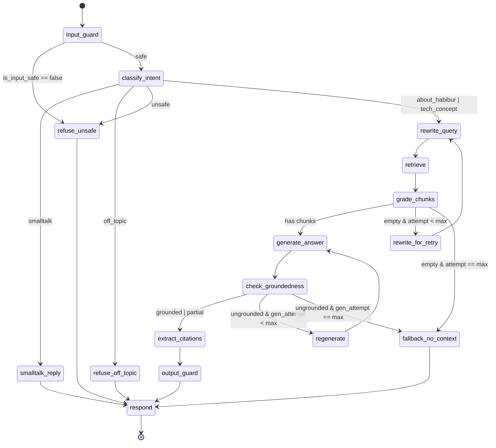

# LangGraph Agent

> **Audience:** Python/FastAPI contributors new to this codebase.
> **Source of truth:** `chatbot/agent/graph.py`, `chatbot/agent/state.py`, `chatbot/agent/nodes/`.

---

## 1. Mental model

The agent is a state machine. Every node has the signature `AgentState → AgentState`: it receives the full state dict, does its work, and returns a (shallow) merged copy with updated keys. State is a `TypedDict` (`chatbot/agent/state.py:42`); routing is decided by predicate functions that inspect state, not by node return values. LangGraph calls the active node, feeds its output back into state, evaluates the appropriate conditional edge predicate, and dispatches to the next node until `END` is reached.

---

## 2. AgentState reference

Defined at `chatbot/agent/state.py:42-65` (`total=False`, so all keys are optional at construction time; `default_state()` at line 68 initialises the mandatory ones).

| Field | Type | Set by | Read by |
|---|---|---|---|
| `query` | `str` | `input_guard` (cleaned), caller via `default_state` | all nodes |
| `history` | `list[Message]` | caller via `default_state` | `rewrite_query`, `generate_answer` |
| `trace_id` | `str` | caller via `default_state` | (observability only) |
| `intent` | `Intent` | `classify_intent`; fallbacks set fixed values | `_route_after_classify`; `respond` (default fill) |
| `is_input_safe` | `bool` | `input_guard` | `_route_after_input_guard` |
| `search_query` | `str` | `rewrite_query` | `retrieve` |
| `hypothetical_doc` | `str \| None` | — (reserved, unused in current nodes) | — |
| `chunks` | `list[ScoredChunk]` | `retrieve`; filtered down by `grade_chunks` | `grade_chunks`, `generate_answer`, `check_groundedness`, `extract_citations` |
| `chunk_grades` | `list[ChunkGrade]` | `grade_chunks` | (debugging / observability) |
| `retrieval_attempt` | `int` | `default_state` (→ 0); `rewrite_for_retry` (increments) | `rewrite_query` (hint injection); `_route_after_grade` |
| `draft` | `str \| None` | `generate_answer` | `check_groundedness`, `extract_citations` |
| `groundedness` | `Groundedness \| None` | `check_groundedness` | `_route_after_groundedness` |
| `generation_attempt` | `int` | `default_state` (→ 0); `regenerate` (increments) | `generate_answer` (strict-mode injection); `_route_after_groundedness` |
| `answer` | `str` | `extract_citations`; `output_guard` (redact/trim); fallback nodes; `respond` (default fill) | `output_guard`, HTTP response serialiser |
| `sources` | `list[SourceRef]` | `extract_citations`; fallback nodes (→ `[]`) | HTTP response serialiser |
| `terminal` | `bool` | `respond`, all fallback nodes | HTTP response serialiser |
| `node_timings_ms` | `dict[str, float]` | `default_state` (→ `{}`); middleware timing wrapper | observability |
| `tokens` | `dict[str, int]` | `default_state` (→ `{"in": 0, "out": 0}`); every LLM-calling node accumulates | `respond` (default fill), observability |

---

## 3. Graph diagram



---

## 4. Node catalog

### Main path

---

### `input_guard`

- **File:** `chatbot/agent/nodes/input_guard.py`
- **Prompt:** N/A
- **Model:** N/A
- **Reads:** `query`
- **Writes:** `query` (cleaned), `is_input_safe`

First node in every execution. Strips ASCII control characters, rejects empty or over-length queries (configurable `max_query_length`), then calls `chatbot/security/prompt_injection.py:detect()` — a heuristic regex + Shannon-entropy scanner — to block obvious injection attempts. No LLM call is made; the entire gate is rules-only. Sets `is_input_safe = False` on any rejection; routing then goes directly to `refuse_unsafe` without touching the LLM.

**Failure modes:** If `detect()` raises unexpectedly, the exception propagates and LangGraph surfaces a graph error. There is no internal try/except; the injection detector itself is pure Python with no I/O, so failures in practice come from upstream (missing `query` key).

---

### `classify_intent`

- **File:** `chatbot/agent/nodes/classify_intent.py`
- **Prompt:** `chatbot/agent/prompts/classify_intent.md`
- **Model:** Gemini Flash
- **Reads:** `query`, `tokens`
- **Writes:** `intent`, `tokens`

Asks Gemini Flash for a single-token label from the `Intent` literal set (`smalltalk`, `off_topic`, `about_habibur`, `tech_concept`, `unsafe`). Uses `temperature=0.0` and `max_tokens=8` for a near-deterministic, cheap classification. Any label not in the valid set falls back to `off_topic`, so malformed LLM output is safe by default. Accumulates token counts into `state["tokens"]`.

**Failure modes:** An `LLMError` propagates (no internal catch). A garbled label that is not in `_VALID` routes to `refuse_off_topic` via the default branch in `_route_after_classify`.

---

### `rewrite_query`

- **File:** `chatbot/agent/nodes/rewrite_query.py`
- **Prompt:** `chatbot/agent/prompts/rewrite_query.md`
- **Model:** Gemini Flash
- **Reads:** `query`, `history`, `retrieval_attempt`, `tokens`
- **Writes:** `search_query`, `tokens`

Resolves anaphora and expands vague phrasing so the downstream vector search has a self-contained query string. On a retry pass (`retrieval_attempt > 0`) it appends a hint instructing the model to use synonyms or a broader formulation. On `LLMError` it falls back silently to the original `query`, so retrieval still proceeds (possibly with lower quality). Uses the last six turns of `history` for context.

**Failure modes:** On `LLMError` the fallback is `search_query = state["query"]`; the graph continues to `retrieve` with the raw user query. No retry logic inside this node — retries are managed by `rewrite_for_retry` in the outer loop.

---

### `retrieve`

- **File:** `chatbot/agent/nodes/retrieve.py`
- **Prompt:** N/A
- **Model:** N/A
- **Reads:** `search_query`, `query` (fallback)
- **Writes:** `chunks`

Calls `searcher.search(query)` where `searcher` is injected as a `HybridSearcher` (see `05-retrieval-rag.md`). Maps each `ChunkHit` from the DB layer to the immutable `ScoredChunk` dataclass. Always writes `chunks` (may be an empty list). Uses `search_query` if present, otherwise falls back to `query`.

**Failure modes:** Any exception from the searcher propagates. An empty result list is not an error; `grade_chunks` then writes empty `chunk_grades`, and the routing predicate handles the retry/fallback path.

---

### `grade_chunks`

- **File:** `chatbot/agent/nodes/grade_chunks.py`
- **Prompt:** `chatbot/agent/prompts/grade_chunks.md`
- **Model:** Gemini Flash
- **Reads:** `query`, `chunks`, `tokens`
- **Writes:** `chunks` (filtered), `chunk_grades`, `tokens`

Sends all retrieved chunks to Gemini Flash in a single call and expects a JSON array of grades (`"yes"`, `"partial"`, `"no"`). Filters `chunks` in-place, keeping only those graded `yes` or `partial`. If the LLM response is malformed or the array length mismatches, all chunks are retained with grade `partial` (fail-open). Empty input (`chunks == []`) short-circuits immediately without an LLM call, returning empty `chunk_grades`.

**Failure modes:** Malformed JSON → fail-open (all chunks kept as `partial`). If after filtering no chunks remain, `_route_after_grade` routes to retry or fallback.

---

### `generate_answer`

- **File:** `chatbot/agent/nodes/generate_answer.py`
- **Prompt:** `chatbot/agent/prompts/generate_answer.md`
- **Model:** Gemini Pro
- **Reads:** `query`, `chunks`, `history`, `generation_attempt`, `tokens`
- **Writes:** `draft`, `tokens`

The only node that uses the more capable (and more expensive) Gemini Pro model. Renders the graded chunks as numbered context blocks and the last six history turns, then generates a draft answer. On a retry pass (`generation_attempt > 0`) it appends a strict-mode instruction limiting the model to verbatim context only, reducing hallucination risk. Writes the result to `draft` (not yet `answer`); `extract_citations` promotes it to `answer`.

**Failure modes:** `LLMError` propagates. There is no internal fallback — the graph-level retry loop (via `regenerate` + `check_groundedness`) is the retry mechanism.

---

### `check_groundedness`

- **File:** `chatbot/agent/nodes/check_groundedness.py`
- **Prompt:** `chatbot/agent/prompts/check_groundedness.md`
- **Model:** Gemini Flash
- **Reads:** `chunks`, `draft`, `tokens`
- **Writes:** `groundedness`, `tokens`

Asks Gemini Flash whether the `draft` is fully supported by the retrieved `chunks`. Returns one of `grounded`, `partial`, or `ungrounded`. Uses `temperature=0.0` and `max_tokens=8` for a deterministic verdict. Any label outside the valid set is treated as `ungrounded` (safe default triggers retry or fallback).

**Failure modes:** `LLMError` propagates. An invalid label is mapped to `ungrounded`, which triggers the retry branch.

---

### `extract_citations`

- **File:** `chatbot/agent/nodes/extract_citations.py`
- **Prompt:** N/A
- **Model:** N/A
- **Reads:** `draft`, `chunks`
- **Writes:** `answer`, `sources`

Pure Python. Scans `draft` for `[N]` citation markers using a regex, maps each to the corresponding `ScoredChunk` by 1-based index, and deduplicates references. Constructs `SourceRef` objects with a 240-character excerpt. Promotes `draft` to `answer`. If no citation markers are found, `sources` is an empty list but `answer` is still set.

**Failure modes:** Index out of range (e.g., `[99]` when only 3 chunks exist) is silently ignored. No LLM call; no I/O failure modes.

---

### `output_guard`

- **File:** `chatbot/agent/nodes/output_guard.py`
- **Prompt:** `chatbot/agent/prompts/output_guard.md`
- **Model:** Gemini Flash
- **Reads:** `query`, `answer`, `tokens`
- **Writes:** `answer`

Final safety check before the answer leaves the graph. Makes an LLM call asking whether the answer contains a `system_leak` (prompt content exposed) or a `scope_violation` (content outside the portfolio scope). If either flag is true, replaces `answer` with a fixed canned refusal. On any LLM or JSON-parse failure it falls back to rules-only: runs PII redaction (`chatbot/security/pii.redact`) and truncates to `max_answer_chars`. The LLM check is best-effort; the rules-only fallback ensures the guard never silently passes bad output due to its own failure.

**Failure modes:** LLM failure → falls back to rules-only redact+truncate. Malformed JSON verdict → same fallback path.

---

### `respond`

- **File:** `chatbot/agent/nodes/respond.py`
- **Prompt:** N/A
- **Model:** N/A
- **Reads:** (all state)
- **Writes:** `terminal`, `answer` (default fill), `sources` (default fill), `intent` (default fill), `tokens` (default fill)

Terminal node. Sets `terminal = True` and fills any still-absent keys (`answer`, `sources`, `intent`, `tokens`) with safe defaults using `setdefault`. Every path through the graph — happy path and all fallbacks — converges here before `END`.

**Failure modes:** None; pure dict manipulation.

---

### Fallbacks & helpers

---

### `smalltalk_reply`

- **File:** `chatbot/agent/nodes/fallbacks.py` (shared with `refuse_off_topic`, `refuse_unsafe`, `fallback_no_context`)
- **Prompt:** N/A (inline prompt string in node body)
- **Model:** Gemini Flash
- **Reads:** `query`, `tokens`
- **Writes:** `answer`, `sources`, `intent`, `terminal`, `tokens`

Reached when `classify_intent` labels the query as casual conversation. Generates a single short friendly sentence via Gemini Flash using a hardcoded inline prompt; no separate prompt file. Sets `sources = []`, `intent = "smalltalk"`, `terminal = True`, then routes to `respond`.

**Failure modes:** `LLMError` propagates; there is no internal fallback to a canned string.

---

### `refuse_off_topic`

- **File:** `chatbot/agent/nodes/fallbacks.py` (shared)
- **Prompt:** N/A
- **Model:** N/A
- **Reads:** (state passthrough)
- **Writes:** `answer`, `sources`, `intent`, `terminal`

Pure Python. Returns a fixed `OFF_TOPIC_REPLY` string directing users to `/projects` or `/resume`. Sets `terminal = True`.

**Failure modes:** None.

---

### `refuse_unsafe`

- **File:** `chatbot/agent/nodes/fallbacks.py` (shared)
- **Prompt:** N/A
- **Model:** N/A
- **Reads:** (state passthrough)
- **Writes:** `answer`, `sources`, `intent`, `terminal`

Pure Python. Returns `"I can't help with that."` Sets `intent = "unsafe"` and `terminal = True`. Reachable from both `input_guard` (heuristic rejection) and `classify_intent` (LLM-classified unsafe intent).

**Failure modes:** None.

---

### `rewrite_for_retry`

- **File:** `chatbot/agent/graph.py:68` (inline helper `_rewrite_for_retry`)
- **Prompt:** N/A
- **Model:** N/A
- **Reads:** `retrieval_attempt`
- **Writes:** `retrieval_attempt` (incremented)

Inline helper registered as a graph node. Increments `retrieval_attempt` by 1 so that `rewrite_query` knows to use a broader reformulation on the next pass, and so the `_route_after_grade` predicate can enforce the retry budget. Contains no business logic beyond the counter increment.

**Failure modes:** None.

---

### `fallback_no_context`

- **File:** `chatbot/agent/nodes/fallbacks.py` (shared)
- **Prompt:** N/A
- **Model:** N/A
- **Reads:** (state passthrough)
- **Writes:** `answer`, `sources`, `terminal`

Pure Python. Returns a fixed `NO_CONTEXT_REPLY` string when all retrieval retries are exhausted or when the generated answer remains ungrounded after all generation retries. Sets `terminal = True` and `sources = []`.

**Failure modes:** None.

---

### `regenerate`

- **File:** `chatbot/agent/graph.py:72` (inline helper `_bump_generation_attempt`)
- **Prompt:** N/A
- **Model:** N/A
- **Reads:** `generation_attempt`
- **Writes:** `generation_attempt` (incremented)

Inline helper registered as a graph node. Increments `generation_attempt` by 1 so that `generate_answer` activates its strict-mode instruction on the next pass and `_route_after_groundedness` can enforce the generation retry budget.

**Failure modes:** None.

---

## 5. Routing logic

All conditional edges are defined in `chatbot/agent/graph.py`.

- **After `input_guard`** — predicate `_route_after_input_guard` (`graph.py:35`): if `state["is_input_safe"]` is `False` (or absent) → `refuse_unsafe`; otherwise → `classify_intent`.

- **After `classify_intent`** — predicate `_route_after_classify` (`graph.py:39`): maps `intent` to destination: `smalltalk` → `smalltalk_reply`, `off_topic` → `refuse_off_topic`, `unsafe` → `refuse_unsafe`, `about_habibur` → `rewrite_query`, `tech_concept` → `rewrite_query`. Any intent value not in the map (e.g., a future label or a garbled LLM response) defaults to `refuse_off_topic` via `dict.get(..., "refuse_off_topic")`.

- **After `grade_chunks`** — predicate `_route_after_grade` (`graph.py:50`): if `state["chunks"]` is non-empty after grading → `generate_answer`; else if `state["retrieval_attempt"] < max_retrieval_retries` → `rewrite_for_retry`; else → `fallback_no_context`. The `max_retries` value is injected via `functools.partial` at graph-build time.

- **After `check_groundedness`** — predicate `_route_after_groundedness` (`graph.py:59`): if `groundedness` is `"grounded"` or `"partial"` → `extract_citations`; else if `state["generation_attempt"] < max_generation_retries` → `regenerate`; else → `fallback_no_context`. The `max_retries` value is injected via `functools.partial` at graph-build time.

---

## 6. Retry budgets

Both budgets are configurable parameters of `build_graph()` (`chatbot/agent/graph.py:86-87`):

```python
max_retrieval_retries: int = 1
max_generation_retries: int = 1
```

These defaults can also be overridden via `chatbot/config.py` and passed through the FastAPI app factory at startup. With the defaults:

- **Retrieval:** one retry pass is allowed. If `grade_chunks` returns empty chunks twice, the graph routes to `fallback_no_context`. Each retry adds one Gemini Flash call in `rewrite_query` and one Flash call in `grade_chunks`.

- **Generation:** one retry pass is allowed. If `check_groundedness` returns `ungrounded` twice, the graph routes to `fallback_no_context`. Each retry adds one Gemini Pro call in `generate_answer` and one Flash call in `check_groundedness`.

**Worked example — single ungrounded answer:**

1. `generate_answer` produces a draft → `check_groundedness` returns `ungrounded`.
2. `generation_attempt == 0 < 1` → routes to `regenerate`.
3. `regenerate` sets `generation_attempt = 1` → routes back to `generate_answer`.
4. `generate_answer` runs again in strict mode → `check_groundedness` returns `ungrounded` again.
5. `generation_attempt == 1`, which is NOT `< 1` → routes to `fallback_no_context`.

**Cost implication:** Each retrieval retry adds approximately two Flash calls (one rewrite, one grade). Each generation retry roughly doubles the Pro tokens spent on that request because a full second `generate_answer` call is made with the same context. With both budgets at 1, the worst-case token spend per request is: 1 Flash (classify) + 2 Flash (rewrite × 2) + 2 Flash (grade × 2) + 2 Pro (generate × 2) + 2 Flash (groundedness × 2) + 1 Flash (output\_guard) = 8 Flash calls + 2 Pro calls.

---

## 7. See also

- [`03-chat-flow.md`](03-chat-flow.md) — end-to-end HTTP request lifecycle, how the graph is invoked per turn
- [`05-retrieval-rag.md`](05-retrieval-rag.md) — HybridSearcher internals, embedding pipeline, Qdrant/pgvector setup
- [`09-glossary.md`](09-glossary.md) — definitions for `Intent`, `Groundedness`, `ScoredChunk`, `SourceRef`, and other domain types
