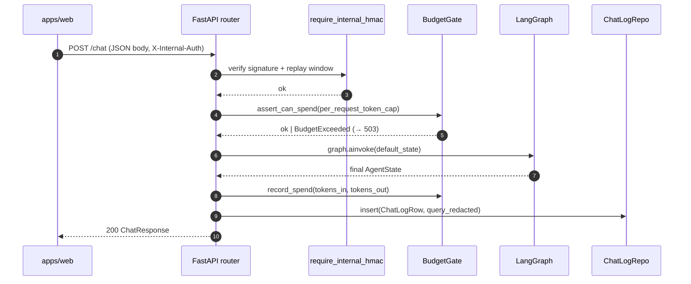
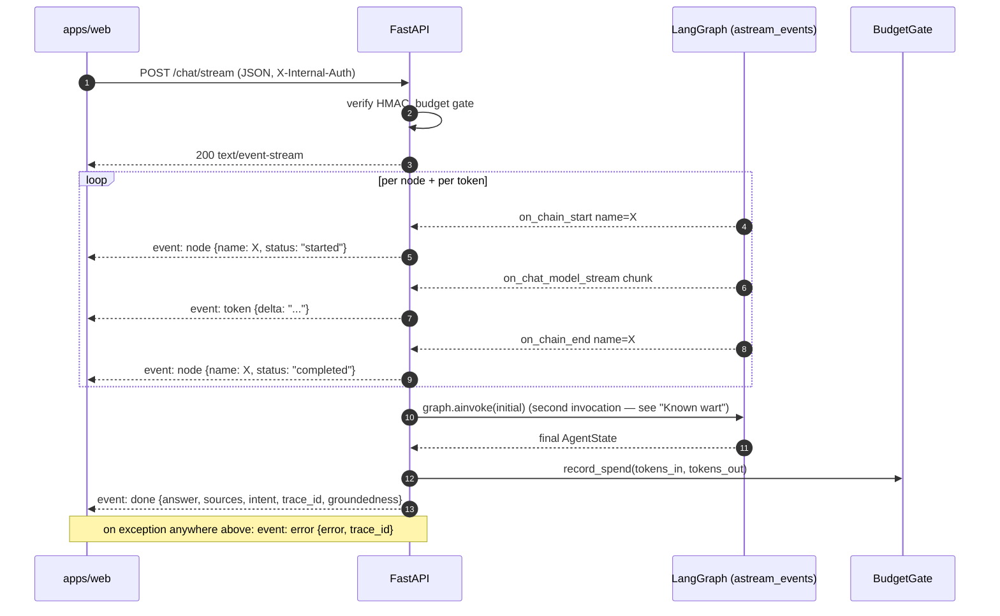

# 03 — Chat Flow

> **Path convention:** all `path:line` references are relative to `apps/chatbot/`.
> So `chatbot/api/routes.py` lives on disk at `apps/chatbot/chatbot/api/routes.py`.

---

## 1. Two endpoints, one graph

`POST /chat` returns a JSON `ChatResponse`; `POST /chat/stream` returns an
`text/event-stream` (SSE) response. Both invoke the same compiled `ctx.graph`
that is built exactly once during application lifespan — see
[01-architecture.md](01-architecture.md) for how the graph is compiled and
injected into `AppContext`.

---

## 2. POST /chat — sequence diagram + walkthrough



Arrow annotations (all in `chatbot/api/routes.py`):

| # | What happens | Location |
|---|---|---|
| 1 | Request received by `chat()` handler | `:66` |
| 2–3 | HMAC dependency enforced via `Depends(require_internal_hmac)` | `:66`, `chatbot/api/auth.py:45` |
| 4–5 | `await ctx.budget.assert_can_spend(...)` | `:71` |
| 5 (fail) | `BudgetExceeded` caught, `HTTPException(503)` raised | `:72–73` |
| 6–7 | `await ctx.graph.ainvoke(initial)` | `:77` |
| 8 | `await ctx.budget.record_spend(tokens_in, tokens_out)` | `:88` |
| 9 | `await ctx.chat_log_repo.insert(ChatLogRow(...))` | `:112` |
| 10 | Handler returns `ChatResponse` | `:124` |

Before inserting the log row, `redact(body.query)` (`chatbot/security/pii.py:27`)
strips emails, phone numbers, and high-entropy tokens from the stored query.

---

## 3. Request / response schema

Source: `chatbot/api/schemas.py`. Handler: `chatbot/api/routes.py:66`.

### `ChatRequest`

| Field | Type | Required | Notes |
|---|---|---|---|
| `query` | `str` | yes | 1–500 chars |
| `session_id` | `str \| null` | no | Opaque session identifier |
| `trace_id` | `str \| null` | no | UUID; generated server-side if absent |
| `history` | `list[ChatMessage]` | no | Prior turns; each has `role` + `content` |

`ChatMessage.role` is `"user"` or `"assistant"`; `content` is 1–4000 chars.

**Example request body:**

```json
{
  "query": "What stack does Habibur use?",
  "session_id": "sess_abc123",
  "history": [
    {"role": "user", "content": "Hi"},
    {"role": "assistant", "content": "Hello! How can I help?"}
  ]
}
```

### `ChatResponse`

| Field | Type | Notes |
|---|---|---|
| `answer` | `str` | LLM-generated answer text |
| `sources` | `list[Source]` | Retrieved chunks cited in the answer |
| `intent` | `Intent` | One of `smalltalk`, `off_topic`, `about_habibur`, `tech_concept`, `unsafe` |
| `trace_id` | `str` | UUID for this request (use in `/chat/feedback`) |
| `metadata` | `ChatMetadata` | Groundedness, attempt counts, latency, token counts |

`Source` fields: `id`, `title`, `source_type`, `slug`, `url`, `score`, `excerpt`.

`ChatMetadata` fields: `groundedness` (`grounded`/`partial`/`ungrounded`/`null`),
`retrieval_attempts`, `generation_attempts`, `latency_ms`,
`tokens` — `{"in": int, "out": int}` (the Python attribute is `in_` because `in` is a reserved
word; Pydantic serialises it as `"in"`).

**Example response:**

```json
{
  "answer": "Habibur works with Next.js, FastAPI, and PostgreSQL.",
  "sources": [
    {
      "id": "chunk_001",
      "title": "About",
      "source_type": "about",
      "slug": "about",
      "url": null,
      "score": 0.91,
      "excerpt": "Full-stack developer specialising in Next.js and Python."
    }
  ],
  "intent": "about_habibur",
  "trace_id": "550e8400-e29b-41d4-a716-446655440000",
  "metadata": {
    "groundedness": "grounded",
    "retrieval_attempts": 1,
    "generation_attempts": 1,
    "latency_ms": 842,
    "tokens": {"in": 410, "out": 72}
  }
}
```

---

## 4. POST /chat/stream — sequence diagram + SSE event shapes



Handler: `chatbot/api/routes.py:127`. Budget gate: `:131–133`.

### SSE event types

All events are emitted by `sse_event()` (`chatbot/api/sse.py:8`), which formats
them as `event: <type>\ndata: <json>\n\n`.

**`event: node`** — emitted on graph node start and end (`routes.py:142–145`):
```
event: node
data: {"name": "<node_name>", "status": "started" | "completed"}
```

**`event: token`** — emitted per LLM output chunk (`routes.py:146–151`):
```
event: token
data: {"delta": "<text fragment>"}
```
Only non-empty `chunk.content` values are emitted.

**`event: done`** — emitted after streaming completes (`routes.py:155–163`):
```
event: done
data: {"answer": "...", "sources": [...], "intent": "...", "trace_id": "...", "groundedness": "grounded"|"partial"|"ungrounded"|null}
```

**`event: error`** — emitted if any exception escapes the stream loop (`routes.py:165–166`):
```
event: error
data: {"error": "<message>", "trace_id": "..."}
```

**Known wart:** the stream handler calls `ctx.graph.astream_events()` to emit
node/token events, then calls `ctx.graph.ainvoke(initial)` a **second time** on
the same initial state — meaning the graph effectively runs twice per streaming
request, roughly doubling LLM token spend relative to a single pass. Because
`record_spend` only accounts for the second (ainvoke) pass's `tokens`, recorded
daily-budget usage under-counts streaming requests. This is likely unintended; a
future refactor should either capture the final state from `astream_events`
events or share the result across both code paths. If the second invocation
throws, the `except` at `:165` catches it and emits `event: error` — the HTTP
status remains 200 because headers were already sent.

**Persistence asymmetry:** unlike `/chat`, the stream handler does not call
`chat_log_repo.insert` and therefore does not persist a `ChatLogRow`. Streaming
requests do not appear in offline evaluation or `/chat/feedback` joins — see
`07-observability.md`.

---

## 5. Auth path

Both `X-Internal-Auth` (the HMAC signature) and `X-Internal-Timestamp` (the
signing time) are required; the `_verify` helper at `chatbot/api/auth.py:29`
raises 401 if either is missing. The `require_internal_hmac` FastAPI dependency
(`chatbot/api/auth.py:45`) verifies the signature against configured secrets and
rejects replayed requests outside the configured replay window. See
[06-security.md](06-security.md) for the canonical-string construction scheme.

---

## 6. Budget path

Two checkpoints surround every graph call:

1. **Before** (`chatbot/api/routes.py:71`, `:131` for stream): `assert_can_spend`
   compares `per_request_token_cap` against today's remaining allowance. If the
   cap exceeds remaining budget, `BudgetExceeded` is raised and the handler
   converts it to `HTTPException(503)` (`:72–73`, `:132–133`).

2. **After** (`:88`, `:154` for stream): `record_spend` increments today's usage
   with the actual `tokens_in`/`tokens_out` from the final `AgentState`. Daily
   cap logic lives in `chatbot/llm/budget.py` (`BudgetGate`).

See [06-security.md](06-security.md) for the full budget design and database
schema.

---

## 7. POST /chat/feedback

Handler: `chatbot/api/routes.py:192`. Auth: same `require_internal_hmac`
dependency.

**`FeedbackRequest`** (`chatbot/api/schemas.py:85`):

| Field | Type | Required | Notes |
|---|---|---|---|
| `trace_id` | `str` | yes | UUID from a prior `/chat` or `/chat/stream` response |
| `vote` | `"up" \| "down"` | yes | Thumbs signal |

The handler calls `chat_log_repo.record_feedback(UUID(body.trace_id), body.vote)`
which issues `UPDATE chatbot.chat_logs SET feedback = $1 WHERE trace_id = $2`
and returns `True` only if a row was updated. If `trace_id` is unknown (no row
matched) the handler raises `HTTPException(404, "trace_id not found")` at `:196`.

Feedback votes are the substrate for offline evaluation pipelines. See
[07-observability.md](07-observability.md) for how they feed into quality
metrics.

---

## 8. Failure modes

| Condition | HTTP | Where raised | Response body |
|---|---|---|---|
| Bad HMAC / stale timestamp | 401 | `chatbot/api/auth.py:29,42` | `{"detail": "..."}` |
| Per-request cap > remaining budget | 503 | `chatbot/api/routes.py:73` | `{"detail": "daily Gemini budget exhausted"}` |
| `chat_feedback` unknown `trace_id` | 404 | `chatbot/api/routes.py:196` | `{"detail": "trace_id not found"}` |
| Unhandled graph exception (stream) | 200 + `event: error` SSE | `chatbot/api/routes.py:165` | SSE `event: error` payload |
| Unhandled graph exception (JSON) | 500 | FastAPI default handler | `{"detail": "Internal Server Error"}` |

---

## 9. See also

- [02-langraph-agent.md](02-langraph-agent.md) — graph nodes, state machine, retry logic
- [06-security.md](06-security.md) — HMAC canonical string, secret rotation, budget design
- [07-observability.md](07-observability.md) — metrics, structured logging, feedback evaluation
