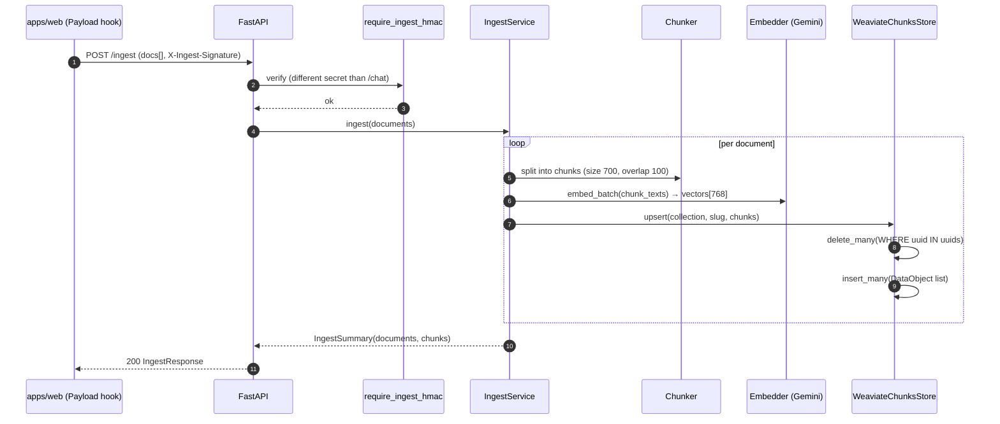

> All source paths below are relative to `apps/chatbot/` (so `chatbot/api/routes.py` lives on disk at `apps/chatbot/chatbot/api/routes.py`).

# 04 — Ingest Flow

## 1. Purpose

`apps/web` calls `POST /ingest` whenever a Project or Post is published in Payload CMS; the chatbot becomes the source of truth for retrievable content. The companion `DELETE /documents/{collection}/{slug}` is wired to Payload's `afterDelete` hook on those same collections, removing stale chunks so they cannot surface in retrieval.

---

## 2. POST /ingest — Sequence Diagram



**Arrow annotations** (verified against source):

| # | What actually happens | Where |
|---|---|---|
| 1 | Payload hook POSTs a JSON body with `documents[]` and headers `X-Ingest-Signature` + `X-Ingest-Timestamp` | `chatbot/api/auth.py:14-15` |
| 2 | FastAPI dependency `require_ingest_hmac` reads `ingest_secrets()` — a separate env var from the internal HMAC secret used by `/chat` | `chatbot/api/auth.py:58-68` |
| 3 | Signature verified via `verify_request`; 401 on failure | `chatbot/api/auth.py:36-42` |
| 4 | Route handler (`:171`) constructs `IngestService` per-request with a fresh `Chunker`, `ctx.embedder`, and `WeaviateChunksStore(ctx.weaviate_collection)` — not injected via lifespan DI | `chatbot/api/routes.py:174` |
| 5–9 | **Actual order differs from the per-document diagram**: the service first deletes all docs (`service.py:30-31`), then chunks all (`service.py:35-37`), then embeds the full batch in one call (`service.py:43`), then upserts all records (`service.py:63`). The diagram is a logical view. | `chatbot/ingest/service.py:28-64` |
| 10 | `WeaviateChunksStore.upsert` issues a `delete_many` followed by `insert_many` — the two-phase shape avoids partial-update edge cases and matches the previous `ON CONFLICT DO UPDATE` semantics | `chatbot/retrieval/weaviate_store.py` |
| 11 | Returns `IngestSummary(documents=N, chunks=M)` | `chatbot/ingest/service.py:64` |
| 12 | Handler wraps summary into `IngestResponse` + a fresh `trace_id` | `chatbot/api/routes.py:176` |

---

## 3. Schema

### IngestRequest

| Field | Type | Constraints |
|---|---|---|
| `documents` | `list[IngestDocument]` | min length 1 |

### IngestDocument

| Field | Type | Constraints |
|---|---|---|
| `collection` | `str` | 1–64 chars |
| `slug` | `str` | 1–200 chars |
| `title` | `str` | 1–300 chars |
| `content` | `str` | min length 1 (note: field is `content`, not `body`) |
| `source_type` | `SourceType` | default `"other"` |
| `url` | `str \| null` | optional |
| `metadata` | `dict[str, str]` | default `{}` |

Source: `chatbot/api/schemas.py:61-68`.

### IngestResponse

| Field | Type | Notes |
|---|---|---|
| `ingested` | `int` | count of documents processed |
| `chunks` | `int` | total chunks stored |
| `trace_id` | `str` | UUID generated per-request |

Source: `chatbot/api/schemas.py:75-78`.

**Example request:**

```json
{
  "documents": [
    {
      "collection": "posts",
      "slug": "how-i-built-my-portfolio",
      "title": "How I Built My Portfolio",
      "content": "I started with Next.js and Payload CMS...",
      "source_type": "post",
      "url": "https://habib36.dev/blog/how-i-built-my-portfolio",
      "metadata": {"author": "Habibur Rahman"}
    }
  ]
}
```

**Example response:**

```json
{
  "ingested": 1,
  "chunks": 3,
  "trace_id": "a1b2c3d4-e5f6-7890-abcd-ef1234567890"
}
```

---

## 4. Chunking

The `Chunker` (700-char window, 100-char overlap, recursive separators) is invoked synchronously per document inside `IngestService.ingest()` before the batch embed call — see `chatbot/ingest/service.py:36`. For the full algorithm and retrieval implications see [05-retrieval-rag.md](05-retrieval-rag.md).

---

## 5. DELETE /documents/{collection}/{slug}

Handler at `chatbot/api/routes.py:179`. Also protected by `require_ingest_hmac` (same secret as `/ingest`). Constructs `IngestService` per-request and calls `svc.delete(collection, slug)` (`routes.py:188`), which delegates to `WeaviateChunksStore.delete_document(collection, slug)`. Issues a `delete_many` with `Filter.by_property("collection").equal(c) & Filter.by_property("slug").equal(s)` and returns `result.successful` as the deleted count.

**DeleteResponse** (`chatbot/api/schemas.py:81-82`):

| Field | Type |
|---|---|
| `deleted` | `int` |

**Example response:**

```json
{"deleted": 3}
```

---

## 6. Idempotency

Re-ingesting the same document is safe. The ingest service builds one `weaviate.classes.data.DataObject` per chunk:

```python
DataObject(
    properties={"external_id": id, "collection": c, "slug": s, "chunk_index": i,
                "title": t, "source_type": st, "url": u, "content": text,
                "metadata_json": json.dumps(metadata)},
    uuid=uuid5(NAMESPACE_URL, id),
    vector=embedding,
)
```

A deterministic UUID5 of the external id means re-ingesting the same chunk replaces the prior object. Internally, `WeaviateChunksStore.upsert` issues a `delete_many(where=Filter.by_id().contains_any(uuids))` followed by `insert_many(...)` — the two-phase shape avoids partial-update edge cases and matches the previous `ON CONFLICT DO UPDATE` semantics.

**Delete by document.** `delete_document(collection, slug)` issues a `delete_many` with `Filter.by_property("collection").equal(c) & Filter.by_property("slug").equal(s)` and returns `result.successful` as the deleted count.

There is no chunk-level diffing. The tradeoff is simple semantics at the cost of embedding tokens on every re-ingest — even if the content has not changed.

---

## 7. See Also

- [05-retrieval-rag.md](05-retrieval-rag.md) — how stored chunks are retrieved and ranked at query time
- [06-security.md](06-security.md) — HMAC signing, replay protection, and the separate ingest vs. internal secrets
