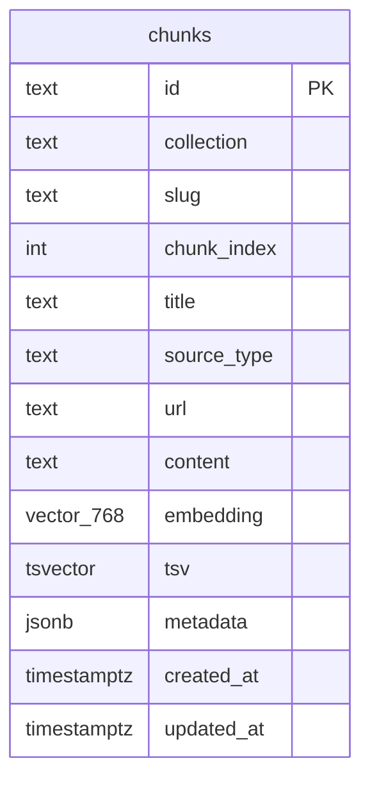

# 05 – Retrieval & RAG Pipeline

> All source paths below are relative to `apps/chatbot/` (so `chatbot/retrieval/pgvector.py` lives on disk at `apps/chatbot/chatbot/retrieval/pgvector.py`).

The retrieval layer turns a raw user query into a ranked list of text chunks that are injected into the generator prompt. Four components do the work: **Chunker → Embedder → pgvector schema → HybridSearcher**.

---

## 1. Chunker

**File:** `chatbot/retrieval/chunker.py`

`Chunker` wraps LangChain's `RecursiveCharacterTextSplitter`. Sizes are **characters**, not tokens (`length_function=len`, `chunker.py:22`).

| Setting | Default | Source |
|---|---|---|
| `chunk_size` | 700 chars | `config.py:38` |
| `chunk_overlap` | 100 chars | `config.py:39` |

**Split strategy** (`chunker.py:23`): tries separators in order — `"\n\n"`, `"\n"`, `". "`, `" "`, `""` — falling back to character splitting only when none match. This is paragraph → sentence → word → character priority, so semantic units survive intact when possible.

**Why 700 / 100:**
- 700 chars ≈ 130–160 tokens — small enough to retrieve tight snippets without diluting the relevance signal, yet far under Gemini Flash's context window ceiling for the generation step.
- A 100-char overlap (~14 % of chunk size) prevents entities or sentences that cross a boundary from disappearing from both neighbours.

```python
# chunker.py:15-24
class Chunker:
    def __init__(self, chunk_size: int = 700, chunk_overlap: int = 100) -> None:
        ...
        self._splitter = RecursiveCharacterTextSplitter(
            chunk_size=chunk_size,
            chunk_overlap=chunk_overlap,
            length_function=len,
            separators=["\n\n", "\n", ". ", " ", ""],
        )
```

`Chunker.split()` (`chunker.py:26-31`) strips leading/trailing whitespace, delegates to `_splitter.split_text()`, and wraps results in `Chunk(text, index)` dataclasses.

---

## 2. Embedder

**File:** `chatbot/retrieval/embedder.py`

`GeminiEmbeddingClient` wraps the Google GenAI async SDK.

| Property | Value | Source |
|---|---|---|
| Model | `gemini-embedding-001` | `embedder.py:18`, `config.py:30` |
| Output dimension | 768 (Matryoshka truncation) | `embedder.py:19`, `config.py:31` |
| Async? | Yes — `aio.models.embed_content` | `embedder.py:30` |
| Batched? | Yes — 100 texts per API call | `embedder.py:41-44` |

**Key methods:**

- `_embed_batch(texts)` (`embedder.py:29-35`): sends a single batched request; extracts `.values` from each `Embedding` object.
- `aembed_query(text)` (`embedder.py:37-39`): wraps `_embed_batch` for a single string; used by the searcher at query time.
- `aembed_documents(texts, *, batch_size=100)` (`embedder.py:41-45`): slices the input into 100-item windows and collects results; used during ingest.

There is no explicit retry logic inside the embedder — callers rely on the ingest pipeline's retry layer (see `04-ingest-flow.md`).

---

## 3. pgvector Schema

**Migration:** `migrations/0001_init.sql`



> Note: `id` is `text` (not `uuid`) — a deterministic hash built by the ingest pipeline so re-ingesting the same document is idempotent. `tsv` is a **generated stored column** (`to_tsvector('english', content)`) — it is never written directly; Postgres maintains it automatically (`0001_init.sql:17`).

**Indexes** (`0001_init.sql:23-25`):

| Index | Type | Column(s) | Purpose |
|---|---|---|---|
| `chunks_embedding_idx` | HNSW (`vector_cosine_ops`) | `embedding` | ANN vector search |
| `chunks_tsv_idx` | GIN | `tsv` | Full-text / BM25 candidate scan |
| `chunks_doc_idx` | B-tree | `(collection, slug)` | Document-level deletes and lookups |

HNSW is chosen over IVFFlat because it supports incremental inserts without requiring a periodic `VACUUM`/rebuild; this matters for an online ingest API.

---

## 4. Hybrid Search

**File:** `chatbot/retrieval/pgvector.py` — `HybridSearcher.search(query)`

### Step-by-step

1. **Embed the query** (`pgvector.py:21`): `GeminiEmbeddingClient.aembed_query(query)` → 768-dim float vector.

2. **Dense (vector) ranking** (`pgvector.py:23-28`, CTE `dense`): orders all chunks by **cosine distance** (`embedding <=> $1`) and takes the top `candidate_pool=20` rows, assigning `ROW_NUMBER()` rank.

3. **Sparse (lexical) ranking** (`pgvector.py:29-34`, CTE `sparse`): filters rows where `tsv @@ plainto_tsquery('english', query)` matches, then orders by `ts_rank(tsv, ...)` descending. Takes the same `candidate_pool=20` rows, assigning `ROW_NUMBER()` rank.

4. **RRF fusion** (`pgvector.py:36-42`): joins both CTEs into `chatbot.chunks` (keeping any row that appeared in either), computes:

   ```
   score = COALESCE(1 / (k + dense_rank), 0)
         + COALESCE(1 / (k + sparse_rank), 0)
   ```

   with `k = rrf_k = 60` (`config.py:41`). `COALESCE(..., 0)` means a chunk absent from one list contributes zero from that leg rather than crashing.

5. **Return top-k** (`pgvector.py:42`): `ORDER BY score DESC LIMIT top_k` where `top_k = retrieval_top_k = 8` (`config.py:40`).

### Worked Example — RRF with 3 chunks

Query: `"FastAPI dependency injection"`

| Chunk | Dense rank | Sparse rank | RRF score |
|---|---|---|---|
| A — "FastAPI uses `Depends()`…" | 2 | 1 | 1/(60+2) + 1/(60+1) = **0.03268** |
| B — "Dependency injection patterns…" | 3 | 2 | 1/(60+3) + 1/(60+2) = **0.03204** |
| C — "pgvector cosine similarity…" | 1 | — | 1/(60+1) + 0 = **0.01639** |

Chunk A wins: it ranks highly in both legs. Chunk C appears only in the dense results (no lexical match for "FastAPI dependency injection") so its score is roughly half of A's despite having the best vector rank.

---

## 5. Why Hybrid vs. Pure Vector

Pure-vector retrieval fails on **exact-match terms** common in a developer portfolio corpus: library names (`asyncpg`, `pgvector`), file paths (`chatbot/retrieval/chunker.py`), version strings (`gemini-2.5-flash`), and method names (`aembed_documents`). These are low-frequency tokens that embeddings smear across the semantic neighbourhood; the lexical leg catches them with precise BM25-style matching. Conversely, the vector leg handles paraphrases and cross-lingual queries that BM25 misses. RRF fusion keeps both strengths without requiring per-corpus weight tuning.

---

## See Also

- [04-ingest-flow.md](04-ingest-flow.md) — how documents reach the `chunks` table
- [09-glossary.md](09-glossary.md) — RRF, HNSW, Matryoshka embeddings, tsvector
