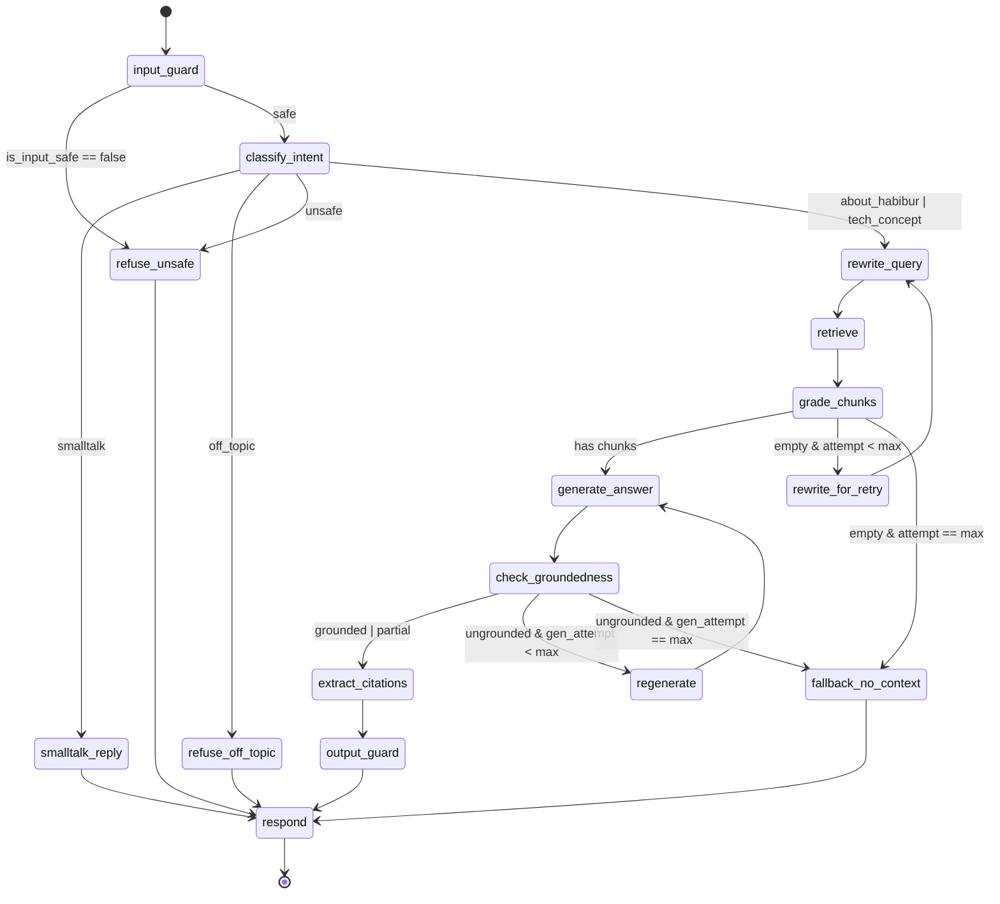
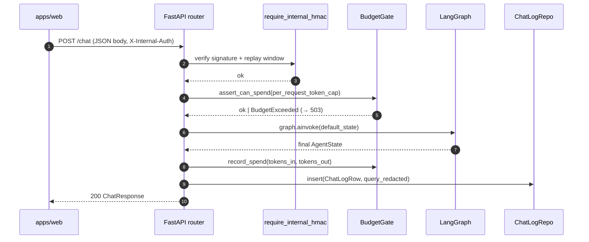
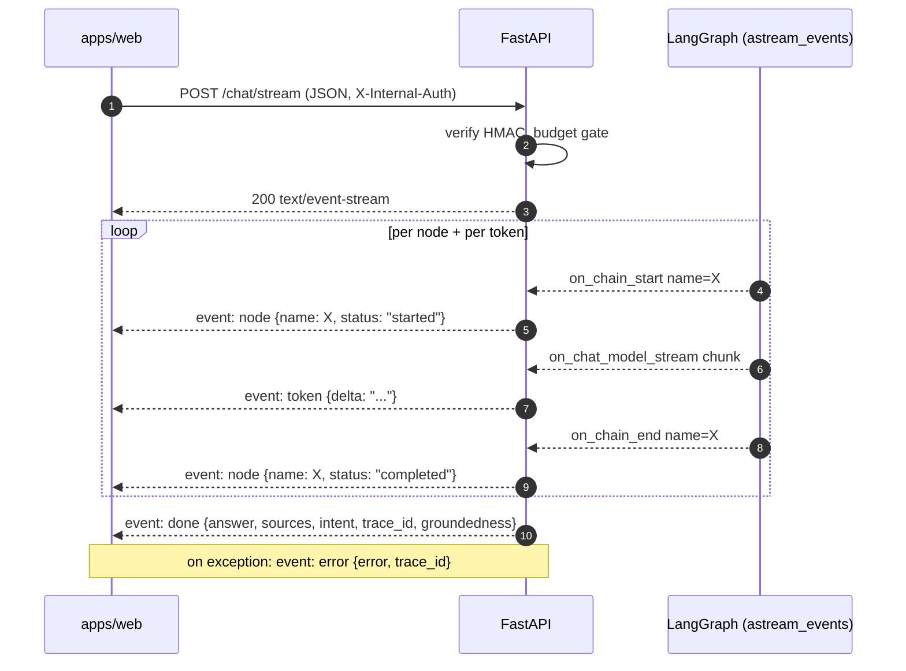
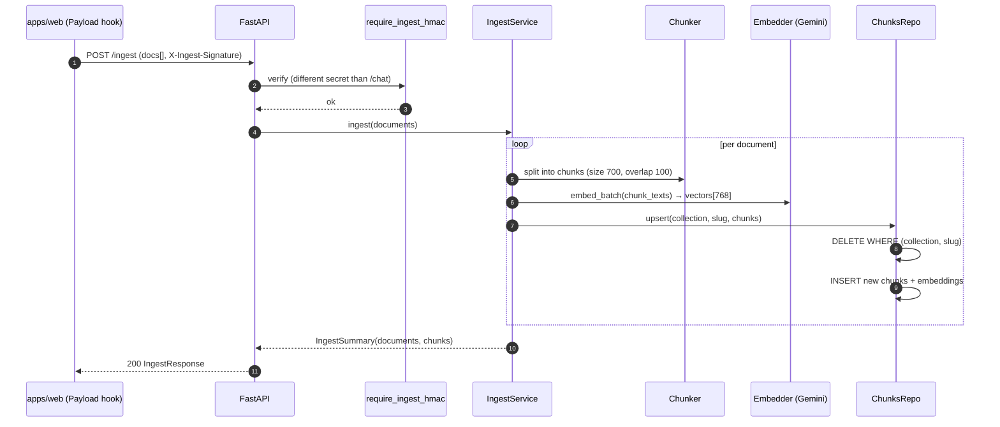
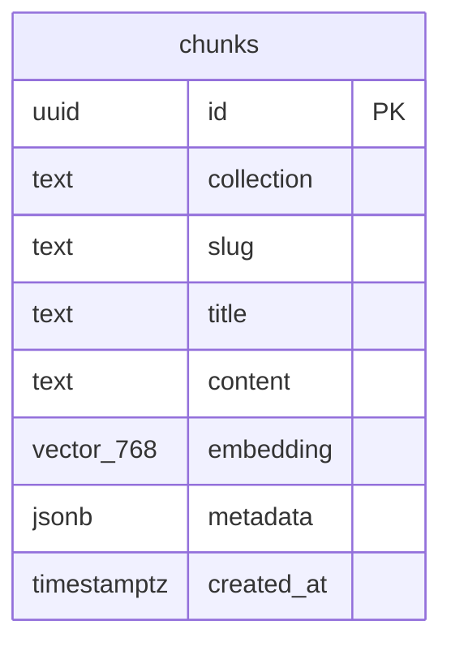

# Chatbot app documentation — implementation plan

> **For agentic workers:** REQUIRED SUB-SKILL: Use superpowers:subagent-driven-development (recommended) or superpowers:executing-plans to implement this plan task-by-task. Steps use checkbox (`- [ ]`) syntax for tracking.

**Goal:** Author the documentation set described in `docs/superpowers/specs/2026-05-23-chatbot-app-docs-design.md` — ten markdown files under `apps/chatbot/docs/`, plus a trimmed top-level README, covering architecture, the LangGraph agent, request flows, retrieval/RAG, security, observability, and ops.

**Architecture:** Documentation-only work. No code changes. Files are written in a foundation-first order (folder skeleton + index → deep-dive docs → glossary → top-level README trim → final cross-link pass). Each doc is verified by rendering its mermaid diagrams in VS Code preview before commit.

**Tech Stack:** Markdown (GitHub-flavored), Mermaid for diagrams, `path:line` source refs.

---

## Conventions used in this plan

- **Verifying mermaid:** Open the file in VS Code with the *Markdown Preview Mermaid Support* extension active, or push the branch and open the file on GitHub. A broken diagram shows as a code block with `Unable to render rich display` (GitHub) or a red error (VS Code).
- **Verifying `path:line` refs:** For each ref in the form `chatbot/X.py:N`, open the file at line N to confirm the cited symbol is still there. Drift caught at write-time is cheap; drift caught at read-time is expensive.
- **Doc tone:** Imperative, terse, "the why before the how." Avoid restating Python or FastAPI basics. Avoid duplicating source code — link to it.
- **No prompts inlined.** Prompts live in `chatbot/agent/prompts/*.md`; docs link to them, never paste them.
- **Commit per doc.** One commit per file (or per `apps/chatbot/README.md` trim). Each commit must leave the tree in a coherent state — earlier docs can reference later ones via filename even before those are written, because filenames are fixed in §4 of the spec.

---

## File map

Files to create:

```
apps/chatbot/docs/README.md
apps/chatbot/docs/01-architecture.md
apps/chatbot/docs/02-langraph-agent.md
apps/chatbot/docs/03-chat-flow.md
apps/chatbot/docs/04-ingest-flow.md
apps/chatbot/docs/05-retrieval-rag.md
apps/chatbot/docs/06-security.md
apps/chatbot/docs/07-observability.md
apps/chatbot/docs/08-ops-deploy.md
apps/chatbot/docs/09-glossary.md
```

Files to modify:

```
apps/chatbot/README.md     # trim architecture-ish content, link into docs/
```

---

## Task 0: Skeleton — create docs/ folder with index stub

**Files:**
- Create: `apps/chatbot/docs/README.md`

- [ ] **Step 1: Create `apps/chatbot/docs/README.md` with the index stub**

Content:

```markdown
# Chatbot documentation

Internal-only RAG service for habib36.dev. Gemini + LangGraph + pgvector behind a FastAPI HTTP boundary. Called by `apps/web` over the Docker network with HMAC-signed requests.

## Read in this order

1. [`01-architecture.md`](./01-architecture.md) — 10,000-ft view, package map, ADRs.
2. [`02-langraph-agent.md`](./02-langraph-agent.md) — the agent state machine, every node.
3. [`03-chat-flow.md`](./03-chat-flow.md) — `POST /chat` and `POST /chat/stream`.
4. [`04-ingest-flow.md`](./04-ingest-flow.md) — `POST /ingest` and `DELETE /documents`.
5. [`05-retrieval-rag.md`](./05-retrieval-rag.md) — chunking, embedding, hybrid search.
6. [`06-security.md`](./06-security.md) — HMAC, PII, prompt injection, budget.
7. [`07-observability.md`](./07-observability.md) — logging, tracing, metrics, chat_log.
8. [`08-ops-deploy.md`](./08-ops-deploy.md) — Docker, env, migrations, runbook.
9. [`09-glossary.md`](./09-glossary.md) — terms.

## 10-minute fast path

Read **`01-architecture.md`** and **`03-chat-flow.md`**. You'll be able to follow a request end-to-end and know where to dig deeper.

## If you're here to…

- **Change a prompt** → [`02-langraph-agent.md`](./02-langraph-agent.md) (find the node, then edit `chatbot/agent/prompts/<node>.md`).
- **Tune retrieval** → [`05-retrieval-rag.md`](./05-retrieval-rag.md).
- **Debug an HMAC rejection** → [`06-security.md`](./06-security.md).
- **Ship a deploy** → [`08-ops-deploy.md`](./08-ops-deploy.md).
```

- [ ] **Step 2: Verify the file renders on GitHub-flavored markdown**

The links resolve once subsequent files exist. For now confirm the file is well-formed (no broken backticks, headings nest cleanly).

- [ ] **Step 3: Commit**

```bash
git add apps/chatbot/docs/README.md
git commit -m "docs(chatbot): add docs/ index stub"
```

---

## Task 1: 01-architecture.md

**Files:**
- Create: `apps/chatbot/docs/01-architecture.md`

**Source files to consult before writing:**
- `apps/chatbot/chatbot/main.py:42-100` — `create_app` and lifespan
- `apps/chatbot/chatbot/api/deps.py` — the `AppContext` dataclass
- `apps/chatbot/chatbot/config.py` — `Settings`
- `apps/chatbot/docs/superpowers/specs/2026-05-22-chatbot-langraph-refactor-design.md` (already at `docs/superpowers/specs/`) — for the ADRs

- [ ] **Step 1: Read the four source files above; note actual line numbers for each citation you'll make**

- [ ] **Step 2: Write `apps/chatbot/docs/01-architecture.md`**

Sections (from spec §5.2):

1. **What this service is** — one paragraph.
2. **System context** — include this mermaid diagram exactly:

   ````markdown
   ```mermaid
   flowchart LR
     U[User] -->|HTTPS| W["apps/web<br/>(Next.js + Payload)"]
     W -->|HMAC: X-Internal-Auth<br/>POST /chat, /chat/stream, /chat/feedback| C["apps/chatbot<br/>(FastAPI + LangGraph)"]
     W -->|HMAC: X-Ingest-Signature<br/>POST /ingest, DELETE /documents| C
     C -->|asyncpg| DB[("Postgres 17<br/>+ pgvector")]
     C -->|HTTPS| G[Gemini API]
   ```
   ````

3. **Package map** — table: package → one-line purpose → entry-point `path:line`. Populate from:
   - `chatbot/agent/` → `agent/graph.py:76` (`build_graph`)
   - `chatbot/api/` → `api/routes.py:44` (`router`)
   - `chatbot/llm/` → `llm/base.py` (protocols), `llm/gemini.py` (impl)
   - `chatbot/retrieval/` → `retrieval/pgvector.py` (`HybridSearcher`)
   - `chatbot/ingest/` → `ingest/service.py`
   - `chatbot/db/` → `db/pool.py`, `db/chunks_repo.py`, `db/chat_log_repo.py`, `db/budget_repo.py`
   - `chatbot/security/` → `security/hmac.py`, `security/pii.py`, `security/prompt_injection.py`
   - `chatbot/observability/` → `observability/{logger,metrics,tracing}.py`

4. **Lifespan & DI** — describe `create_app(context=None)` in `main.py:42`. Explain: real lifespan builds Postgres pool + Gemini clients + searcher + budget + graph and stuffs them into `AppContext` (`api/deps.py`); tests pass a pre-built `AppContext`. Show the dependency chain in a small mermaid graph:

   ````markdown
   ```mermaid
   flowchart TD
     S[Settings] --> P[asyncpg Pool]
     S --> L[GeminiClient]
     S --> E[GeminiEmbeddingClient]
     P --> H[HybridSearcher]
     E --> H
     P --> B[BudgetGate]
     L --> Gr[build_graph]
     H --> Gr
     B --> Gr
     Gr --> Ctx[AppContext]
     P --> Ctx
     L --> Ctx
     E --> Ctx
     H --> Ctx
     B --> Ctx
   ```
   ````

5. **Architectural decisions** — 8 numbered entries, each *Decision · Why · Tradeoff*, ~3 sentences:
   1. LangGraph over hand-rolled state machine.
   2. pgvector over a dedicated vector DB.
   3. HMAC over JWT for internal calls.
   4. Gemini Flash for cheap nodes + Pro for generation.
   5. Lifespan-built singletons over per-request init.
   6. In-process budget gate over external rate-limiter.
   7. SSE over WebSocket for streaming.
   8. Delete-then-insert ingest over diffing.

6. **See also** footer — link to `02-langraph-agent.md` and `03-chat-flow.md`.

Target length: ≤400 lines.

- [ ] **Step 3: Verify all `path:line` refs**

For every `chatbot/X.py:N` in the doc, open the file at line N and confirm the symbol matches what the doc claims.

- [ ] **Step 4: Verify both mermaid diagrams render**

Open the file in VS Code preview (or push and open on GitHub).

- [ ] **Step 5: Commit**

```bash
git add apps/chatbot/docs/01-architecture.md
git commit -m "docs(chatbot): add 01-architecture (system context + ADRs)"
```

---

## Task 2: 02-langraph-agent.md (centerpiece)

**Files:**
- Create: `apps/chatbot/docs/02-langraph-agent.md`

**Source files to consult before writing:**
- `apps/chatbot/chatbot/agent/state.py` — `AgentState`, `Intent`, `Groundedness`, `ChunkGrade`, `ScoredChunk`, `SourceRef`, `Message`
- `apps/chatbot/chatbot/agent/graph.py` — node wiring, conditional routes, retry helpers
- All files in `apps/chatbot/chatbot/agent/nodes/` — one section per node
- All prompts in `apps/chatbot/chatbot/agent/prompts/`

- [ ] **Step 1: Read every file in `agent/nodes/` and note for each node**

Per node, note: file path, which prompt it uses, what `LLMClient.complete` model name it's invoked with, which `AgentState` fields it reads, which it writes, and failure behavior.

- [ ] **Step 2: Write the doc — Section "Mental model"**

One short paragraph: "the agent is a state machine; each node is `AgentState → AgentState`. State is a `TypedDict` (`agent/state.py:42`); routing is decided by predicate functions over state, not return values."

- [ ] **Step 3: Write the doc — Section "AgentState reference"**

Table with columns: field · type · set-by node(s) · read-by node(s). Cover every key in `AgentState` (`agent/state.py:42-65`). Source the set/read columns from your Step 1 notes.

- [ ] **Step 4: Write the doc — Section "Graph diagram"**

Include this mermaid `stateDiagram-v2` exactly (matches `agent/graph.py:109-154`):

````markdown

````

- [ ] **Step 5: Write the doc — Section "Node catalog"**

One H3 per node, in graph order: `input_guard`, `classify_intent`, `rewrite_query`, `retrieve`, `grade_chunks`, `generate_answer`, `check_groundedness`, `extract_citations`, `output_guard`, `respond`. Then fallbacks: `smalltalk_reply`, `refuse_off_topic`, `refuse_unsafe`, `rewrite_for_retry`, `fallback_no_context`, `regenerate`.

For each node use this exact template:

```markdown
### `<node_name>`

**File:** `chatbot/agent/nodes/<file>.py`
**Prompt:** `chatbot/agent/prompts/<file>.md` (or *N/A* if it's pure logic)
**Model:** Gemini Flash | Gemini Pro | N/A
**Reads:** `<state fields>`
**Writes:** `<state fields>`

<one paragraph: what it does and why>

**Failure modes:** <how it can fail and where the graph routes on failure>
```

Special notes:
- `rewrite_for_retry` and `regenerate` are inline helpers defined in `graph.py:68-73`, not separate files. Mark **File:** as `chatbot/agent/graph.py:68` and `:72` respectively.
- All five fallbacks (`smalltalk_reply`, `refuse_off_topic`, `refuse_unsafe`, `fallback_no_context`) live in `chatbot/agent/nodes/fallbacks.py`; cite that file.
- `respond` and `extract_citations` are pure-Python (no LLM call); model is *N/A*.

- [ ] **Step 6: Write the doc — Section "Routing logic"**

Plain-English predicates, one bullet per conditional edge. Each bullet cites the predicate function in `graph.py`:

- After `input_guard` (`graph.py:35`): `state["is_input_safe"]` False → `refuse_unsafe`; else → `classify_intent`.
- After `classify_intent` (`graph.py:39`): intent → node mapping table.
- After `grade_chunks` (`graph.py:50`): chunks present → `generate_answer`; empty & `retrieval_attempt < max_retrieval_retries` → `rewrite_for_retry`; empty & at cap → `fallback_no_context`.
- After `check_groundedness` (`graph.py:59`): `grounded`|`partial` → `extract_citations`; `ungrounded` & under cap → `regenerate`; else → `fallback_no_context`.

- [ ] **Step 7: Write the doc — Section "Retry budgets"**

Document `max_retrieval_retries=1` and `max_generation_retries=1` (defaults in `graph.py:86-87`). Worked example: a single ungrounded answer triggers exactly one `regenerate` then `fallback_no_context` if still ungrounded. Note the cost implication: each retry doubles the Pro tokens for that request.

- [ ] **Step 8: Add "See also" footer linking to `03-chat-flow.md`, `05-retrieval-rag.md`, `09-glossary.md`**

Target length: ≤800 lines.

- [ ] **Step 9: Verify mermaid renders, verify every node section cites its real prompt file**

```bash
ls apps/chatbot/chatbot/agent/prompts/
```
Cross-check the prompt filenames you cited against this list.

- [ ] **Step 10: Commit**

```bash
git add apps/chatbot/docs/02-langraph-agent.md
git commit -m "docs(chatbot): add 02-langraph-agent (state, nodes, routing)"
```

---

## Task 3: 03-chat-flow.md

**Files:**
- Create: `apps/chatbot/docs/03-chat-flow.md`

**Source files to consult before writing:**
- `apps/chatbot/chatbot/api/routes.py:66-124` — `POST /chat`
- `apps/chatbot/chatbot/api/routes.py:127-168` — `POST /chat/stream`
- `apps/chatbot/chatbot/api/routes.py:192-197` — `POST /chat/feedback`
- `apps/chatbot/chatbot/api/schemas.py` — request/response schemas
- `apps/chatbot/chatbot/api/sse.py` — SSE event encoding
- `apps/chatbot/chatbot/llm/budget.py` — `BudgetGate`, `BudgetExceeded`
- `apps/chatbot/chatbot/db/chat_log_repo.py` — `ChatLogRow` shape
- `apps/chatbot/chatbot/security/pii.py` — `redact()`

- [ ] **Step 1: Read the source files; note the exact SSE event types emitted**

In `routes.py:127-168` the stream emits events with `sse_event(name, payload)` where `name` is one of: `node` (status: `started`|`completed`), `token` (delta), `done`, `error`. Document the actual event shape, not the spec's earlier draft phrasing.

- [ ] **Step 2: Write Section "Two endpoints, one graph"**

One paragraph. `/chat` returns JSON; `/chat/stream` streams SSE. Both invoke the same compiled `ctx.graph`.

- [ ] **Step 3: Write Section "POST /chat sequence diagram"**

Include this mermaid `sequenceDiagram` exactly:

````markdown

````

Annotate each arrow with the `path:line` in `routes.py` that performs it (e.g. arrow 4 is `routes.py:71`, arrow 6 is `routes.py:77`, arrow 8 is `routes.py:88`, arrow 9 is `routes.py:112`).

- [ ] **Step 4: Write Section "Request / response schema"**

Table for `ChatRequest` (fields, types, required). Worked example JSON for request and response, drawn from `api/schemas.py`. Cite `routes.py:66` for the handler.

- [ ] **Step 5: Write Section "POST /chat/stream sequence diagram"**

Include this mermaid:

````markdown

````

Below the diagram, document the SSE event payload shapes (all four event types), drawn from `routes.py:142-166`.

- [ ] **Step 6: Write Section "Auth path"**

Two sentences: `X-Internal-Auth` header carries the HMAC; `require_internal_hmac` dependency in `api/auth.py` verifies it. Link out to `06-security.md` for the canonical-string scheme.

- [ ] **Step 7: Write Section "Budget path"**

Where the daily cap and per-request cap are enforced (`routes.py:71` and `routes.py:88`), the `503` response when exceeded (`routes.py:73`), and the per-request cap from `Settings.per_request_token_cap`. Distinguish: per-request cap is enforced *before* graph invocation; daily cap accrues via `record_spend` *after*.

- [ ] **Step 8: Write Section "POST /chat/feedback"**

Body shape (`FeedbackRequest`), `routes.py:192` handler, behavior: looks up `trace_id` in `chat_log`, sets the vote. Returns `404` if `trace_id` unknown (`routes.py:196`). Used downstream for offline evaluation; link to `07-observability.md`.

- [ ] **Step 9: Write Section "Failure modes"**

Table:

| Condition | HTTP | Where raised | Response body |
|---|---|---|---|
| Bad HMAC / stale timestamp | 401 | `api/auth.py` | `{"detail": "..."}` |
| Per-request cap > remaining budget | 503 | `routes.py:73` | `{"detail": "budget exceeded"}` |
| `chat_feedback` unknown trace_id | 404 | `routes.py:196` | `{"detail": "trace_id not found"}` |
| Unhandled graph exception (stream) | 200 + `error` SSE | `routes.py:165` | SSE `event: error` |
| Unhandled graph exception (JSON) | 500 | FastAPI default | `{"detail": "..."}` |

- [ ] **Step 10: "See also" → `02-langraph-agent.md`, `06-security.md`, `07-observability.md`**

Target length: ≤300 lines.

- [ ] **Step 11: Verify mermaid renders and refs check out**

- [ ] **Step 12: Commit**

```bash
git add apps/chatbot/docs/03-chat-flow.md
git commit -m "docs(chatbot): add 03-chat-flow (/chat + /chat/stream walkthrough)"
```

---

## Task 4: 04-ingest-flow.md

**Files:**
- Create: `apps/chatbot/docs/04-ingest-flow.md`

**Source files to consult before writing:**
- `apps/chatbot/chatbot/api/routes.py:171-189` — `POST /ingest`, `DELETE /documents/{collection}/{slug}`
- `apps/chatbot/chatbot/api/schemas.py` — `IngestRequest`, `IngestResponse`, `DeleteResponse`
- `apps/chatbot/chatbot/ingest/service.py` — `IngestService`
- `apps/chatbot/chatbot/db/chunks_repo.py` — `ChunksRepo` (upsert, delete)
- `apps/chatbot/chatbot/api/auth.py` — `require_ingest_hmac`

- [ ] **Step 1: Read the source files**

- [ ] **Step 2: Write Section "Purpose"**

`apps/web` calls `/ingest` when a Project or Post is published in Payload CMS; the chatbot becomes the source of truth for retrievable content. Delete is wired to Payload's `afterDelete` hook on those collections.

- [ ] **Step 3: Write Section "POST /ingest sequence diagram"**

````markdown

````

- [ ] **Step 4: Write Section "Schema"**

Request body shape (collection, slug, title, body, metadata as JSON), response shape (`ingested`, `chunks`, `trace_id`). Drawn from `api/schemas.py`.

- [ ] **Step 5: Write Section "Chunking"**

Two sentences pointing to `05-retrieval-rag.md` for the algorithm. Here only: chunker is invoked by `IngestService.ingest` (`ingest/service.py`).

- [ ] **Step 6: Write Section "DELETE /documents/{collection}/{slug}"**

`routes.py:179` handler. Calls `IngestService.delete` which calls `ChunksRepo.delete(collection, slug)`. Drops every chunk for that document. Returns `{"deleted": <count>}`.

- [ ] **Step 7: Write Section "Idempotency"**

Re-ingesting the same document is safe: `ChunksRepo.upsert` is delete-then-insert per `(collection, slug)`. No chunk-level diffing. Tradeoff: simple to reason about, but every re-ingest spends embedding tokens.

- [ ] **Step 8: "See also" → `05-retrieval-rag.md`, `06-security.md`**

Target length: ≤200 lines.

- [ ] **Step 9: Verify mermaid + refs**

- [ ] **Step 10: Commit**

```bash
git add apps/chatbot/docs/04-ingest-flow.md
git commit -m "docs(chatbot): add 04-ingest-flow (/ingest + delete walkthrough)"
```

---

## Task 5: 05-retrieval-rag.md

**Files:**
- Create: `apps/chatbot/docs/05-retrieval-rag.md`

**Source files to consult before writing:**
- `apps/chatbot/chatbot/retrieval/chunker.py` — `Chunker`
- `apps/chatbot/chatbot/retrieval/embedder.py` — `GeminiEmbeddingClient`
- `apps/chatbot/chatbot/retrieval/pgvector.py` — `HybridSearcher`
- `apps/chatbot/chatbot/db/chunks_repo.py` — `chunks` schema, `ChunkHit`
- `apps/chatbot/migrations/` — SQL files showing the table + indexes

- [ ] **Step 1: Read the source files; pay particular attention to the SQL for hybrid search in `pgvector.py` (this is the highest-value part of the doc)**

- [ ] **Step 2: Write Section "Chunker"**

`chunk_size=700`, `chunk_overlap=100` (from `Settings`). Whether these are characters or tokens — confirm by reading `chunker.py`. Explain why those values: small enough to retrieve relevant snippets, large enough to keep context coherent; overlap prevents losing entities that span boundaries. Cite `retrieval/chunker.py`.

- [ ] **Step 3: Write Section "Embedder"**

`gemini-embedding-001` model, 768 dimensions, batched calls. Cite `retrieval/embedder.py`.

- [ ] **Step 4: Write Section "pgvector schema"**

Include an ER-style diagram. Confirm column list by reading the latest migration in `apps/chatbot/migrations/`.

````markdown

````

Document the indexes: HNSW (or IVFFlat — confirm from migration) on `embedding`, GIN on the tsvector of `content` (for BM25), B-tree on `(collection, slug)`.

- [ ] **Step 5: Write Section "Hybrid search"**

How `HybridSearcher.search(query)` works (`retrieval/pgvector.py`):
1. Compute query embedding.
2. Run BM25 ranking against `content` tsvector.
3. Run vector similarity ranking against `embedding`.
4. Fuse with Reciprocal Rank Fusion: `score = Σ 1/(k + rank_i)` with `k=60`.
5. Return top 8 (`Settings.retrieval_top_k`).

Show a toy worked example with three candidate chunks and how RRF combines ranks from each modality.

- [ ] **Step 6: Write Section "Why hybrid vs pure vector"**

Concrete failure modes on this corpus that pure vector misses: rare terms (proper nouns, library names, file paths) where BM25 dominates. Short paragraph.

- [ ] **Step 7: "See also" → `04-ingest-flow.md` (for how chunks get there), `09-glossary.md`**

Target length: ≤300 lines.

- [ ] **Step 8: Verify mermaid + refs + schema accuracy against migrations**

- [ ] **Step 9: Commit**

```bash
git add apps/chatbot/docs/05-retrieval-rag.md
git commit -m "docs(chatbot): add 05-retrieval-rag (chunking, embedding, RRF)"
```

---

## Task 6: 06-security.md

**Files:**
- Create: `apps/chatbot/docs/06-security.md`

**Source files to consult before writing:**
- `apps/chatbot/chatbot/security/hmac.py` — canonical string, replay window, multi-secret
- `apps/chatbot/chatbot/api/auth.py` — `require_internal_hmac`, `require_ingest_hmac`
- `apps/chatbot/chatbot/security/pii.py` — `redact()`
- `apps/chatbot/chatbot/security/prompt_injection.py` — heuristic detector
- `apps/chatbot/chatbot/llm/budget.py` — `BudgetGate`
- `apps/chatbot/chatbot/db/budget_repo.py` — daily counter persistence

- [ ] **Step 1: Read the source files; note the exact canonical-string format**

- [ ] **Step 2: Write Section "HMAC scheme"**

Canonical signed string format (method, path, body hash, timestamp, nonce — confirm exactly from `hmac.py`). `replay_window_seconds=60` from `Settings`. Multi-secret rotation: `Settings.internal_hmac_secret` accepts CSV, and `Settings.internal_secrets()` splits it (`config.py:65-72`); the verifier tries each secret. Why this allows zero-downtime key rotation.

- [ ] **Step 3: Write Section "Two secrets, two endpoints"**

`X-Internal-Auth` (secret: `Settings.internal_hmac_secret`) for `/chat`, `/chat/stream`, `/chat/feedback`. `X-Ingest-Signature` (secret: `Settings.ingest_hmac_secret`) for `/ingest` and `DELETE /documents/...`. Rationale: ingest credentials live in Payload's environment; chat credentials live in the web frontend's environment. Compromising one doesn't compromise the other.

- [ ] **Step 4: Write Section "PII redaction"**

What `redact()` strips before persistence (emails, phone numbers — confirm from `pii.py`). Where it's applied: `routes.py:115` (`query_redacted` field of `ChatLogRow`). Not applied to outbound LLM calls — that would degrade retrieval; rely on Gemini's safety setting for outbound content.

- [ ] **Step 5: Write Section "Prompt-injection detection"**

Heuristics implemented in `security/prompt_injection.py`. Where they fire in the graph — `input_guard` node (`agent/nodes/input_guard.py`). What gets routed when injection is detected: `refuse_unsafe`.

- [ ] **Step 6: Write Section "Budget gates"**

Daily token cap (`Settings.daily_token_budget=1_000_000`) persisted via `BudgetRepo` (per-day counter). Per-request cap (`Settings.per_request_token_cap=5_000`) used as the pre-flight estimate. The `BudgetExceeded` exception → 503 path documented in `03-chat-flow.md`.

- [ ] **Step 7: Write Section "Threat model"**

Two columns: *defended against* / *explicitly not defended against*. Defended: replay attacks (replay window), token-exhaustion DoS (budget), key compromise (rotation), upstream PII storage (redaction). Not defended: edge DoS (relies on upstream Cloudflare/nginx), side-channels (timing), social engineering, Gemini API trust.

- [ ] **Step 8: "See also" → `03-chat-flow.md`, `04-ingest-flow.md`, `08-ops-deploy.md` (for env var setup)**

Target length: ≤300 lines.

- [ ] **Step 9: Verify refs**

- [ ] **Step 10: Commit**

```bash
git add apps/chatbot/docs/06-security.md
git commit -m "docs(chatbot): add 06-security (HMAC, PII, injection, budget)"
```

---

## Task 7: 07-observability.md

**Files:**
- Create: `apps/chatbot/docs/07-observability.md`

**Source files to consult before writing:**
- `apps/chatbot/chatbot/observability/logger.py` — structured logging config
- `apps/chatbot/chatbot/observability/tracing.py` — OTel setup
- `apps/chatbot/chatbot/observability/metrics.py` — Prometheus metrics
- `apps/chatbot/chatbot/db/chat_log_repo.py` — `ChatLogRow`, feedback recording
- `apps/chatbot/chatbot/api/routes.py:58-63` — `/metrics` endpoint
- `apps/chatbot/chatbot/api/routes.py:112-123` — chat_log persistence

- [ ] **Step 1: Read the source files**

- [ ] **Step 2: Write Section "Structured logging"**

JSON fields emitted (`trace_id`, `node`, `latency_ms`, `tokens_in`, `tokens_out` — confirm from `logger.py`). How `LOG_LEVEL` is read (`config.py:62`). Cite the formatter line.

- [ ] **Step 3: Write Section "OTel tracing"**

What `configure_tracing()` does (`observability/tracing.py`). How `OTEL_ENDPOINT` is read (`config.py:60`). Span names per node (the LangGraph integration emits one per node by name).

- [ ] **Step 4: Write Section "Prometheus metrics"**

Table of metrics from `observability/metrics.py`:

| Metric | Type | Labels | What it measures |
|---|---|---|---|
| `record_request` (name in code) | Counter | `intent`, `outcome` | Total chat requests |
| `record_request_duration` | Histogram | `intent` | End-to-end latency ms |
| `record_tokens` | Counter | `model` | Gemini tokens in/out |
| `record_groundedness` | Counter | `groundedness` | Distribution of grounded/partial/ungrounded |
| `set_budget_remaining` | Gauge | — | Tokens remaining in today's budget |

Confirm the actual metric names from the code (these are the function names; the underlying Prometheus names may differ).

`/metrics` endpoint at `routes.py:58`, served as `text/plain; version=0.0.4`.

- [ ] **Step 5: Write Section "chat_log repo"**

`ChatLogRow` shape (from `db/chat_log_repo.py`). Persisted on every `/chat` (`routes.py:112`). What's stored: `trace_id`, `session_id`, `query_redacted`, `intent`, `chunk_ids`, `groundedness`, `latency_ms`, `tokens_in`, `tokens_out`, `error`. Why it's the substrate for offline evaluation: lets you replay queries, compute groundedness drift, A/B prompts.

- [ ] **Step 6: Write Section "Feedback loop"**

How `/chat/feedback` updates a `chat_log` row by `trace_id` (`db/chat_log_repo.py:record_feedback`). How feedback joins back into evaluation.

- [ ] **Step 7: "See also" → `03-chat-flow.md`, `06-security.md` (for PII rules on what gets logged)**

Target length: ≤250 lines.

- [ ] **Step 8: Verify refs**

- [ ] **Step 9: Commit**

```bash
git add apps/chatbot/docs/07-observability.md
git commit -m "docs(chatbot): add 07-observability (logs, traces, metrics, chat_log)"
```

---

## Task 8: 08-ops-deploy.md

**Files:**
- Create: `apps/chatbot/docs/08-ops-deploy.md`

**Source files to consult before writing:**
- `apps/chatbot/Dockerfile`
- `apps/chatbot/docker-entrypoint.sh`
- `apps/chatbot/chatbot/config.py` — every `Settings` field
- `apps/chatbot/chatbot/db/migrate.py`
- `apps/chatbot/migrations/`

- [ ] **Step 1: Read the source files**

- [ ] **Step 2: Write Section "Dockerfile walkthrough"**

Read the actual Dockerfile and document: base image, stages (build vs runtime if multi-stage), why `uv` for deps install, COPY order (cache friendliness), CMD/entrypoint, USER (non-root). One sentence per layer.

- [ ] **Step 3: Write Section "docker-entrypoint.sh"**

What it does before invoking uvicorn (read the script). Migrations run? Health pre-check? Document exactly what's there.

- [ ] **Step 4: Write Section "Environment reference"**

Table of every `Settings` field in `config.py:18-63`: name · default · required for prod (yes/no) · what it controls. ~25 rows. Group by section (Database, Gemini, Retrieval, Agent, Security, Budget, Output guard, Observability).

- [ ] **Step 5: Write Section "Migrations"**

`uv run python -m chatbot.db.migrate` (matches the README quick-start). Read `db/migrate.py` to document: how migrations are tracked (which table? versioned filenames?), how to roll back (or, if no rollback, say so explicitly).

- [ ] **Step 6: Write Section "Runbook"**

Five entries, each ~5 lines:
1. **Gemini API key rotation.** Add new key to `GEMINI_API_KEY` env, redeploy, verify with `/health`. No downtime because clients are rebuilt in lifespan.
2. **Daily budget exhausted.** Symptom: all `/chat` return 503. Verify with the `budget_remaining` gauge in Prometheus. Mitigation: raise `DAILY_TOKEN_BUDGET` and redeploy, or wait for midnight UTC rollover.
3. **pgvector index rebuild.** When recall degrades after large ingest. Run `REINDEX INDEX CONCURRENTLY chunks_embedding_hnsw_idx;` against the DB. (Confirm index name from migration.)
4. **HMAC replay-window failures.** Symptom: 401s correlating with NTP drift. Verify pod clock against the caller's. Mitigation: fix clock skew; don't widen `REPLAY_WINDOW_SECONDS` unless you understand the replay risk.
5. **DB pool exhausted.** Symptom: `asyncpg.exceptions.TooManyConnectionsError` or hung requests. Verify pool size vs concurrent requests. Mitigation: raise `DB_POOL_MAX` after confirming Postgres `max_connections` headroom.

- [ ] **Step 7: "See also" → `01-architecture.md`, `06-security.md`, `07-observability.md`**

Target length: ≤350 lines.

- [ ] **Step 8: Verify refs**

- [ ] **Step 9: Commit**

```bash
git add apps/chatbot/docs/08-ops-deploy.md
git commit -m "docs(chatbot): add 08-ops-deploy (Docker, env, migrations, runbook)"
```

---

## Task 9: 09-glossary.md

**Files:**
- Create: `apps/chatbot/docs/09-glossary.md`

- [ ] **Step 1: Write the glossary file with these terms (alphabetized)**

Each entry: 1–3 sentences, plain language, link to the doc where it's used in depth.

Terms to define:
- **AgentState** — the LangGraph `TypedDict` carrying everything between nodes. See `02-langraph-agent.md`.
- **BM25** — keyword-ranking algorithm; one of the two signals in hybrid search. See `05-retrieval-rag.md`.
- **Budget gate** — daily and per-request token caps enforced before each `/chat`. See `06-security.md`.
- **Chunk** — a 700-character window of a document with overlap, embedded once. See `05-retrieval-rag.md`.
- **Citation** — `SourceRef` pointing back to a chunk; emitted by `extract_citations`. See `02-langraph-agent.md`.
- **Embedding** — 768-dim vector representation of a chunk produced by Gemini. See `05-retrieval-rag.md`.
- **Flash / Pro** — Gemini 2.5 Flash (cheap, used for guards/classification/grading/grounding/output-guard) vs Pro (expensive, used for generation only). See `01-architecture.md` ADR #4.
- **Groundedness** — `grounded` | `partial` | `ungrounded`; how well the answer is supported by retrieved chunks. See `02-langraph-agent.md`.
- **HMAC** — keyed hash over the canonical request; how internal calls are authenticated. See `06-security.md`.
- **Hybrid search** — BM25 + vector similarity fused via RRF. See `05-retrieval-rag.md`.
- **Intent** — `smalltalk` | `off_topic` | `unsafe` | `about_habibur` | `tech_concept`; routes the agent. See `02-langraph-agent.md`.
- **LangGraph node** — a function `AgentState → AgentState` registered with the graph. See `02-langraph-agent.md`.
- **PII redaction** — stripping personal data before logging. See `06-security.md`.
- **RAG** — Retrieval-Augmented Generation: retrieve chunks, then generate an answer grounded in them. See `01-architecture.md`.
- **Replay window** — `replay_window_seconds=60`; HMAC requests outside this window are rejected. See `06-security.md`.
- **RRF** — Reciprocal Rank Fusion; combines multiple ranked lists. See `05-retrieval-rag.md`.
- **SSE** — Server-Sent Events; the streaming format used by `/chat/stream`. See `03-chat-flow.md`.
- **trace_id** — UUID assigned per chat request; threads through state, logs, traces, and feedback. See `07-observability.md`.

- [ ] **Step 2: Verify every term is actually used in another doc**

```bash
# Verify each term name above appears in at least one of 01-08
```

- [ ] **Step 3: Commit**

```bash
git add apps/chatbot/docs/09-glossary.md
git commit -m "docs(chatbot): add 09-glossary"
```

---

## Task 10: Trim `apps/chatbot/README.md`

**Files:**
- Modify: `apps/chatbot/README.md`

- [ ] **Step 1: Read the current README to see what to keep**

It currently has: Quick start, Architecture (one-line + spec link), HTTP API table, LangGraph ASCII diagram, Testing tiers.

- [ ] **Step 2: Replace the file with this content**

```markdown
# chatbot

Internal-only Gemini + LangGraph + pgvector RAG service for habib36.dev.
`apps/web` proxies user traffic over the Docker internal network with HMAC-signed requests.

## Quick start

```bash
# from this directory
uv sync
cp .env.example .env       # fill in GEMINI_API_KEY + HMAC secrets
uv run python -m chatbot.db.migrate
uv run uvicorn chatbot.main:app --reload --port 8001
```

Through Turborepo:

```bash
pnpm --filter chatbot dev
pnpm --filter chatbot test
pnpm --filter chatbot test:integration   # needs TEST_DATABASE_URL
pnpm --filter chatbot test:e2e           # needs GEMINI_API_KEY + TEST_DATABASE_URL
pnpm --filter chatbot lint
```

## Documentation

Full docs live in [`docs/`](./docs/README.md). Start there if you're new to this service.

Short index:

- [Architecture](./docs/01-architecture.md)
- [LangGraph agent](./docs/02-langraph-agent.md)
- [`/chat` flow](./docs/03-chat-flow.md)
- [`/ingest` flow](./docs/04-ingest-flow.md)
- [Retrieval & RAG](./docs/05-retrieval-rag.md)
- [Security](./docs/06-security.md)
- [Observability](./docs/07-observability.md)
- [Ops & deploy](./docs/08-ops-deploy.md)
- [Glossary](./docs/09-glossary.md)

## HTTP API

| Method | Path | Auth | Purpose |
|---|---|---|---|
| `GET`    | `/health` | — | Liveness. |
| `GET`    | `/metrics` | — | Prometheus exposition. |
| `POST`   | `/chat` | HMAC | JSON RAG response (LangGraph agent). |
| `POST`   | `/chat/stream` | HMAC | SSE: node events + token deltas. |
| `POST`   | `/ingest` | HMAC | Chunk + embed + upsert documents. |
| `DELETE` | `/documents/{collection}/{slug}` | HMAC | Drop all chunks for one document. |
| `POST`   | `/chat/feedback` | HMAC | Record up/down vote per trace_id. |

All write endpoints require HMAC-signed headers (`X-Internal-Auth` / `X-Ingest-Signature`).
See [`docs/06-security.md`](./docs/06-security.md) for the canonical scheme.

## Testing tiers

| Tier | Command | Real deps |
|---|---|---|
| Unit | `uv run pytest tests/unit` | None — fakes everywhere |
| Integration | `TEST_DATABASE_URL=... uv run pytest tests/integration` | Postgres + pgvector |
| E2E | `GEMINI_API_KEY=... TEST_DATABASE_URL=... uv run pytest tests/e2e` | Real Gemini + Postgres |
```

What's removed compared to current README:
- The historical "Architecture: See `docs/superpowers/specs/...`" line (now lives in `01-architecture.md` as a footnote if needed).
- The ASCII LangGraph diagram (moved and upgraded to mermaid in `02-langraph-agent.md`).

- [ ] **Step 3: Verify it still answers "how do I run this?" in the first 20 lines**

- [ ] **Step 4: Commit**

```bash
git add apps/chatbot/README.md
git commit -m "docs(chatbot): trim README, point into docs/"
```

---

## Task 11: Final cross-link pass

**Files (no creation, only verification):**
- All of `apps/chatbot/docs/*.md`
- `apps/chatbot/README.md`

- [ ] **Step 1: Resolve every relative link**

For each `[...](./XX-name.md)` in every doc, verify the target file exists:

```bash
# from repo root, list referenced files vs actual files
ls apps/chatbot/docs/
```

- [ ] **Step 2: Resolve every `path:line` ref**

For every `chatbot/X.py:N` in every doc, open the file at line N and confirm the cited symbol is still there. Capture a list of any that drift.

- [ ] **Step 3: Glossary completeness**

For every term defined in `09-glossary.md`, confirm it appears in at least one other doc. Drop or expand any orphan terms.

For every acronym appearing in another doc that isn't in the glossary, add it.

- [ ] **Step 4: Mermaid render check**

Open each doc with a mermaid block in VS Code preview (or on GitHub). Capture any that fail to render.

- [ ] **Step 5: Read the docs in order as if you'd never seen the codebase**

Take notes on confusing passages. Fix the worst three. Don't try to polish everything — diminishing returns.

- [ ] **Step 6: Commit any fixes from steps 2, 3, 4, 5**

```bash
git add apps/chatbot/docs/
git commit -m "docs(chatbot): final cross-link + ref pass"
```

If no fixes were needed, skip the commit.

---

## Spec coverage check

| Spec section | Task(s) implementing it |
|---|---|
| §4 File layout | Tasks 0–10 (one file per task, plus README trim in 10) |
| §5.1 docs/README.md | Task 0 |
| §5.2 01-architecture.md | Task 1 |
| §5.3 02-langraph-agent.md | Task 2 |
| §5.4 03-chat-flow.md | Task 3 |
| §5.5 04-ingest-flow.md | Task 4 |
| §5.6 05-retrieval-rag.md | Task 5 |
| §5.7 06-security.md | Task 6 |
| §5.8 07-observability.md | Task 7 |
| §5.9 08-ops-deploy.md | Task 8 |
| §5.10 09-glossary.md | Task 9 |
| §6 source-of-truth rules | Tasks 1–9 (each task verifies path:line refs) |
| §8 acceptance criteria | Task 11 (final pass) |

## Risks & mitigations carried over from spec §9

- **Doc drift** — every task ends with a `path:line` verification step.
- **Length creep** — every task has an explicit target length cap.
- **Mermaid rendering** — every task with a diagram has a "verify mermaid renders" step before commit.
